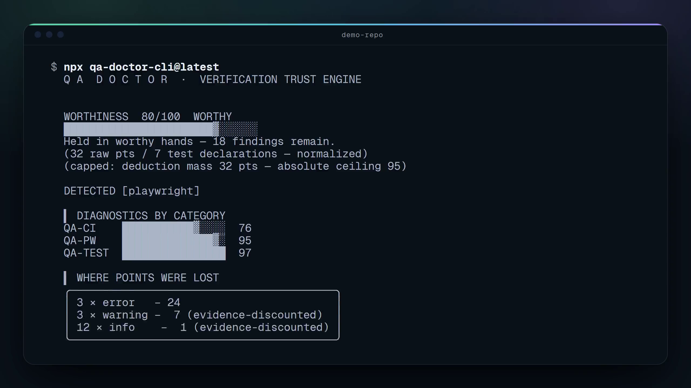

<div align="center">


<br />

يعثر Mjölnir على الاختبارات التي لا يمكن أن تفشل وخطوط CI التي لا يمكن أن تتحول إلى الأحمر،<br />
ثم يقيّم إلى أي حد يمكن الوثوق بالنتيجة، مع الدليل على كل نقطة.

<br />

[](https://www.npmjs.com/package/mjolnir-qa)
[](https://www.npmjs.com/package/mjolnir-qa)
[](https://github.com/Sergey-Bar/Mjolnir/actions/workflows/ci.yml)
[](https://codecov.io/gh/Sergey-Bar/Mjolnir)
[](https://scorecard.dev/viewer/?uri=github.com/Sergey-Bar/Mjolnir)
[](LICENSE)
[](https://nodejs.org)

```bash
npx mjolnir-qa@latest
```

[شاهده وهو يعمل](#شاهده-وهو-يعمل) · [البدء السريع](#البدء-السريع) · [ما الذي يكتشفه](#ما-الذي-يكتشفه-mjölnir) · [الدرجة](#درجة-الجدارة) · [الأدلة](#نموذج-الأدلة) · [تحليل التشغيلات](#تحليل-تشغيلات-الاختبار) · [CI](#سلامة-ci) · [الوكلاء](#وكلاء-الذكاء-الاصطناعي) · [الأمان](#الثقة-والأمان) · [الحدود](#ما-لا-يستطيع-mjölnir-أن-يخبرك-به) · [التوثيق](#التوثيق)

<details>
<summary>اقرأ بلغة أخرى — 22 ترجمة</summary>

[English](README.md) | [简体中文](README.zh.md) | [繁體中文](README.zht.md) | [한국어](README.ko.md) | [Deutsch](README.de.md) | [Español](README.es.md) | [Français](README.fr.md) | [Italiano](README.it.md) | [Dansk](README.da.md) | [日本語](README.ja.md) | [Polski](README.pl.md) | [Русский](README.ru.md) | [Norsk](README.no.md) | [Português (Brasil)](README.br.md) | [ไทย](README.th.md) | [Türkçe](README.tr.md) | [Українська](README.uk.md) | [বাংলা](README.bn.md) | [Ελληνικά](README.gr.md) | [Tiếng Việt](README.vi.md) | [עברית](README.he.md) | العربية | [Bosanski](README.bs.md)

> 🤖 Machine-assisted translation. The [English README](README.md) is canonical. Last synced: 2026-09-15.

<!-- Source hash: 3541b09e8d04 -->

</details>

</div>

<br />

## علامة الصح الخضراء ادعاء، وليست دليلًا

علامة الصح الخضراء تعني أن خط CI لم يفشل. لا تعني أن الاختبارات عملت، ولا أنها كان يمكن أن تفشل. كل واحدة من هذه تمر باللون الأخضر:

- ‏`.only` بقي في commit فشغّل 3 اختبارات بدل 900
- ‏`continue-on-error: true` على الـ job الذي كان يُفترض أن يمنع الدمج
- ‏`|| true` بعد أمر الاختبار
- اختبار لا يتحقق من أي شيء، أو جسمه فارغ
- غلاف إعادة محاولة يحوّل فشلًا حقيقيًا إلى نجاح بالحظ
- تقرير يرفعه الـ workflow لكنه لم يُنشأ قط
- ‏sleep ثابت يُبقي حالة تسابق متماسكة

لا يحوّل أيٌّ منها خط CI إلى الأحمر، وكل واحد منها يبدو مقصودًا عند المراجعة. لهذا تبقى. هذا Mjölnir يقرأ مثالًا حقيقيًا:

<p align="center">
  
</p>

<sub>كل نتيجة أبلغ عنها فحص العرض لهذا الـ workflow، عند السطر الذي أبلغ عنه. مولَّد بواسطة `npm run docs:readme-brand` من [`demo-report.json`](assets/readme/demo-report.json) ومقفل ضد الانحراف في CI.</sub>

**الوضع الصارم.** الكشف الأكثر عدوانية — `.only`، `continue-on-error`، الاختبارات الفارغة، إساءة إعادة المحاولة — تقع في مستوى الحجر الصحي. تعمل فقط مع `--strict` وتُ限定 بخطورة `info`: تُعلم، لكنها لا تُوقف أبدًا. الفحص الافتراضي (`npx mjolnir-qa@latest` بدون `--strict`) يغطي القواعد الأساسية والموسعة فقط. أضف `--strict` عندما تريد طبقة الاستشارات أيضًا.

يقرأ Mjölnir مجموعة الاختبارات وملفات workflow الخاصة بـ CI، وتقرير تشغيل حقيقي إن وُجد. لا يشغّل اختباراتك، ولا يثبّت اعتمادياتك، ولا ينفّذ الشيفرة التي يفحصها. وعندما لا يملك دليلًا، يقول ذلك بدل أن يختلق ثقة:

| الحالة                                                   | ما يبلّغ عنه Mjölnir                                       |
| -------------------------------------------------------- | ---------------------------------------------------------- |
| لم يُعثر على تعريفات اختبارات                            | الدرجة `null`، وتُعرض كـ **UNKNOWN**. لا 100 مختلقة أبدًا. |
| لا يوجد خط أساس أو مراجعة قابلة للمقارنة                 | ‏**UNKNOWN**، مع ذكر السبب. لا 0 مفترضة أبدًا.             |
| توقف الفحص قبل اكتماله (ميزانية الوقت، ملفات غير مقروءة) | ‏**PARTIAL**، رمز الخروج `2`. لا يُعرض أبدًا على أنه نظيف. |

<p align="center">
  
</p>

<sub>صُمّم لهذه الصفحة ويُعرض بمقياس 1:1. مولَّد بواسطة `npm run docs:readme-brand` ومقفل ضد الانحراف في CI؛ الدرجة والأعداد ومعرّف القاعدة تأتي من [`script.demo.json`](assets/video/script.demo.json) و[`demo-report.json`](assets/readme/demo-report.json) وسجل القواعد، ولا تُكتب يدويًا أبدًا. الصورة نفسها كملصق: [`architecture.svg`](assets/readme/architecture.svg).</sub>

<br />

## شاهده وهو يعمل

فحص حقيقي لـ [`examples/demo-repo`](examples/demo-repo)، وهي مجموعة Playwright صغيرة مع workflow لـ CI. هنا ذهبت نقاطها:

<p align="center">
  
</p>

<sub>مولَّد بواسطة `npm run docs:hero` من فحص حقيقي ومقفل ضد الانحراف في CI. تقرير `--verbose` الكامل للفحص نفسه هو [`demo.svg`](assets/readme/demo.svg) (`npm run docs:demo`).</sub>

<details>
<summary><strong>شاهده</strong> — فحص، والإصلاح الذي يطبعه، وإعادة الفحص التي تثبته</summary>

<br />

<p align="center">
  <a href="assets/video/mjolnir-demo.mp4">
    
  </a>
</p>

<sub>رُسم إطارًا بإطار من فحص حقيقي بواسطة `npm run docs:video`؛ ولم يُسجَّل من الشاشة قط. اختر الإطار لفتح [`mjolnir-demo.mp4`](assets/video/mjolnir-demo.mp4).</sub>

</details>

### نتيجة واحدة عن قرب

كل نتيجة تجيب عن أربعة أسئلة: أين هي، ومدى تأكد Mjölnir، وكم مرة تخطئ القاعدة، وكيف تُصلح.

<p align="center">
  
</p>

يطبع `mjolnir explain QA-CI-001` سجل الثقة الكامل لقاعدة ما، بما في ذلك معدل الإيجابيات الكاذبة المقيس لها والمستوى الذي منحها إياه هذا المعدل:

```text
  ▍ QA-CI-001 — continue-on-error masks a failing verification gate

Severity:    error
Confidence:  high
Tier:        quarantine
Evidence:    E2
QA impact:   False-green risk (FALSE-GREEN)
Measured FP: 11% (19 hand-classified corpus verdicts)
FP risk:     low (author estimate)
Languages:   yaml
Frameworks:  github-actions, azure-pipelines

WHAT WAS FOUND (real detector output, not a mockup)
  Job `security-scan` runs a verification gate under `continue-on-error: true`.

WHY IT MATTERS
  This job can fail every day and CI will still show green. The checkmark on
  this workflow cannot be trusted.

HOW TO FIX
  Remove continue-on-error, or scope it to individual non-blocking steps only.

  Example from this rule's own must-fire fixture: QA-CI-001/must-fire/masked.yml

WHAT WOULD CHANGE THE VERDICT
  - a run report next to the scan target (mjolnir.report.json or test-results/)
  corroborating this file lifts its findings to L3–L5
  - a documented suppression (mjolnir.config.json) lowers the finding count
  without claiming correctness
  - quarantine findings run only under --strict and are advisory (E0) — they can
  never gate CI

NEXT ACTION
  Fix the first occurrence, then re-run: `mjolnir --scope changed`. Every
  occurrence of this rule is listed in the scan output.

HOW TO VERIFY THE FIX
  Re-run `mjolnir` on the changed file(s) — this finding should no longer
  appear. `mjolnir --scope changed` scopes the check to just what you touched.

Docs: mjolnir rules --md   (full catalog, this rule included)
```

هذه هي وحدة القيمة: موضع واحد يبلّغ فيه CI عن نجاح لم يستحقه.

<br />

## البدء السريع

```bash
npx mjolnir-qa@latest
```

يفحص الدليل الحالي ويطبع Trust Report: ما الذي وجده، وإلى أي حد يمكنك الوثوق به، ولماذا، وما الخطوة التالية. ويخرج بالرمز `0` عندما لا يُعثر على شيء عند مستوى البوابة أو فوقه.

في CI، افحص فقط ما أدخله الفرع، حتى لا تُغرق مجموعة اختبارات قديمة أول pull request لك:

```bash
npx mjolnir-qa@latest --scope changed
```

يكتب `mjolnir ci install` ذلك كـ workflow لـ GitHub Actions، باستخدام [الـ action](https://github.com/Sergey-Bar/Mjolnir#readme) المثبّت على الوسم الرئيسي `v1` (أو `npx` عادي مع `--no-action`). ويبقى استشاريًا إلى أن تقرر أنه يجب أن يمنع الدمج.

| الأمر                               | ما الذي يفعله                                                |
| ----------------------------------- | ------------------------------------------------------------ |
| `mjolnir`                           | ‏Trust Report: الحكم، ودرجة الثقة، والإجراء التالي           |
| `mjolnir --scope changed`           | فقط ما أدخله فرعك (صيغة CI)                                  |
| `mjolnir ci install`                | ينشئ workflow استشاريًا لطلبات الدمج (قائمًا على الـ action) |
| `mjolnir explain QA-CI-001`         | ماذا ولماذا وكيف يُصلح، مع معدل FP المقيس                    |
| `mjolnir why src/a.spec.ts:42`      | لماذا عُلّم هذا السطر بالتحديد. لا يمنع الدمج أبدًا.         |
| `mjolnir forensics ./test-results/` | أدلة وقت التشغيل من تشغيل حقيقي                              |
| `mjolnir trust-report`              | ‏Trust Artifact مستقل (md + json)                            |
| `mjolnir handoff`                   | خطة معالجة لوكيل برمجة                                       |
| `mjolnir --json` / `--format sarif` | مخرجات قابلة للقراءة آليًا، GitHub Code Scanning             |
| `mjolnir --format codequality`      | تقرير GitLab Code Quality (عنصر لأداة طلب الدمج)             |
| `mjolnir --strict`                  | يشغّل أيضًا قواعد مستوى quarantine (خطر FP أعلى)             |

<details>
<summary><strong>كل الأوامر الأخرى</strong> — فرز الاختبارات غير المستقرة، والتقارير، والحوكمة</summary>

<br />

| الأمر                               | ما الذي يفعله                                                             |
| ----------------------------------- | ------------------------------------------------------------------------- |
| `mjolnir --classic`                 | لافتة الدرجة السابقة لـ Trust Report                                      |
| `mjolnir explain verdict`           | لماذا جاء حكم الفحص المحفوظ على ما هو عليه                                |
| `mjolnir triage ./test-results/`    | فرز موجَّه. كل صف ينتهي بإجراء تالٍ.                                      |
| `mjolnir pw-report ./test-results/` | ملخص تشغيل Playwright: إعادات المحاولة، والاختبارات غير المستقرة، والأبطأ |
| `mjolnir doctor:playwright`         | فحص معمّق خاص بـ Playwright مع Selector Health Score                      |
| `mjolnir fix --dry-run` / `fix`     | إصلاحات تلقائية آمنة، يُعاد فحص كل منها لإثبات أنه نجح                    |
| `mjolnir baseline` / `diff`         | لقطة للنتائج، ثم الإبلاغ عن الجديد أو الأسوأ فقط                          |
| `mjolnir impact --since <ref>`      | ما أدخله commit وما حلّه                                                  |
| `mjolnir summary`                   | تعليقات CI وملخص للخطوة من تقرير                                          |
| `mjolnir pr-comment`                | تعليق محدد النطاق على طلب الدمج، بصيغة Markdown                           |
| `mjolnir debt`                      | سجل الدَّين التقني للاختبارات مع نموذج تكلفة                              |
| `mjolnir handover`                  | خريطة تعريفية بمجموعة الاختبارات لمهندس QA جديد                           |
| `mjolnir init`                      | يكتشف أُطر العمل ويطبع قائمة تحقق للإعداد                                 |
| `mjolnir suppressions`              | يعرض النتائج المكتومة، لأغراض الحوكمة                                     |
| `mjolnir rules --unmeasured`        | القواعد التي تعمل على افتراض، لا على قياس                                 |
| `mjolnir rules --md`                | فهرس القواعد الكامل (JSON أو Markdown)                                    |
| `mjolnir doctor`                    | تدقيق ذاتي لقاعدة قواعد Mjölnir نفسها                                     |
| `mjolnir create-rule <ID>`          | ينشئ هيكلًا لقاعدة جديدة وملفات fixtures الخاصة بها                       |
| `mjolnir stats`                     | عدّادات محلية لكل الإصلاحات التي رُصدت                                    |
| `mjolnir badge`                     | ‏JSON لنقطة نهاية shields.io ومقتطف                                       |
| `mjolnir --cache`                   | إعادات فحص تزايدية عبر ذاكرة تخزين مؤقت محلية للأحكام                     |
| `mjolnir --format mermaid`          | مخطط لبنية الاختبارات لتعليق على طلب الدمج                                |

يطبع `mjolnir help <command>` طريقة الاستخدام والأمثلة والخطوة التالية لأي منها.

</details>

يتطلب **Node.js ≥ 22.18** على Windows أو macOS أو Linux. تفضّل التثبيت العام؟ `npm i -g mjolnir-qa`. يأتي هذا الحد الأدنى من سلسلة أدوات البناء (يستهدفه tsdown ويُجري خط الإصدار اختبارات دخان عليه)؛ ولا تحتاج اعتماديات وقت التشغيل أكثر من ذلك.

<br />

## ما الذي يكتشفه Mjölnir

<p align="center">
  
</p>

**79 قاعدة** في أربع عائلات — نظافة الاختبارات، وجودة الاختبارات، وPlaywright، وسلامة CI — عبر TypeScript وJavaScript وPython وJava وC# وYAML الخاص بـ GitHub Actions. تغطي Playwright في روابطه الأربعة، إضافة إلى pytest وJUnit وTestNG وNUnit وxUnit وMSTest وJest وVitest وMocha، مع تغطية مبدئية لـ Cypress وSelenium. تسع منها، لإظهار الشكل:

| ID           | القاعدة                                                       | الخطورة | المستوى    |
| ------------ | ------------------------------------------------------------- | ------- | ---------- |
| QA-CI-001    | ‏`continue-on-error` يخفي بوابة تحقق فاشلة                    | error   | quarantine |
| QA-CI-009    | رمز خروج الاختبارات لا يُمرَّر (`\|` دون pipefail، سلاسل `;`) | error   | extended   |
| QA-TEST-001  | اختبار مركّز بقي في commit (`.only`، `fit`)                   | error   | quarantine |
| QA-TEST-003  | اختبار بلا تأكيدات                                            | error   | quarantine |
| QA-TQUAL-009 | تأكيد على promise دون await                                   | error   | quarantine |
| QA-PW-002    | تأكيد على locator دون await                                   | error   | core       |
| QA-PW-004    | محددات CSS/XPath هشة                                          | warning | quarantine |
| QA-PY-002    | اختبار متخطى (`skip`، `xfail` غير صارم)                       | warning | core       |
| QA-CS-103    | دالة اختبار بلا تأكيدات                                       | error   | core       |

يُولَّد الفهرس الكامل من السجل ولا يُصان يدويًا أبدًا: `mjolnir rules --md`، أو [`docs/rules/`](docs/rules/)، أو [دليل ما الذي يفحصه](https://sergey-bar.github.io/Mjolnir/guide/what-it-checks).

<details>
<summary><strong>كل قاعدة مذكورة في هذا الملف</strong>، في جدول واحد</summary>

<br />

> قواعد `quarantine` تعمل فقط مع `--strict` ولا تمنع الدمج أبدًا (إذ تُحدّ عند info). الخطورة المعروضة هي التي حددها المؤلف.

| ID           | العائلة    | القاعدة                                              | الخطورة | المستوى    |
| ------------ | ---------- | ---------------------------------------------------- | ------- | ---------- |
| QA-TEST-001  | النظافة    | اختبار مركّز بقي في commit (`.only`، `fit`)          | error   | quarantine |
| QA-TEST-002  | النظافة    | اختبار متخطى. يتصاعد إلى `error` دون سبب متتبَّع.    | warning | quarantine |
| QA-TEST-003  | النظافة    | اختبار بلا تأكيدات                                   | error   | quarantine |
| QA-TEST-004  | النظافة    | ‏sleep ثابت (`waitForTimeout`، `sleep()`، `delay()`) | warning | extended   |
| QA-TEST-006  | النظافة    | إساءة استخدام إعادة المحاولة لإخفاء عدم الاستقرار    | warning | quarantine |
| QA-TEST-010  | النظافة    | جسم اختبار فارغ                                      | error   | quarantine |
| QA-TQUAL-002 | الجودة     | تأكيد تحصيل حاصل                                     | error   | quarantine |
| QA-TQUAL-009 | الجودة     | تأكيد على promise دون await                          | error   | quarantine |
| QA-TQUAL-011 | الجودة     | اختبارات معلّقة كتعليقات                             | warning | extended   |
| QA-PW-002    | Playwright | تأكيد على locator دون await                          | error   | core       |
| QA-PW-003    | Playwright | ‏`page.pause()` / `test.only()` بقيا في commit       | error   | core       |
| QA-PW-004    | Playwright | محددات CSS/XPath هشة                                 | warning | quarantine |
| QA-PW-123    | Playwright | عناوين URL للبيئات مثبتة في الشيفرة                  | warning | quarantine |
| QA-PW-140    | Playwright | لقطة شاشة دون `maxDiffPixelRatio`                    | warning | core       |
| QA-CI-001    | CI         | ‏`continue-on-error` يخفي بوابة فاشلة                | error   | quarantine |
| QA-CI-002    | CI         | ‏`\|\| true` يبتلع رموز الخروج                       | error   | extended   |
| QA-CI-005    | CI         | تقرير يُستهلك لكنه لا يُنشأ أبدًا                    | error   | quarantine |
| QA-CI-007    | CI         | أغلفة إعادة المحاولة حول الاختبارات                  | warning | extended   |
| QA-CI-008    | CI         | خطوة تنجح دائمًا تخفي الإخفاقات                      | error   | quarantine |
| QA-CI-009    | CI         | رمز الخروج لا يُمرَّر (`\|` دون pipefail، سلاسل `;`) | error   | extended   |
| QA-CI-010    | CI         | اختبارات متخطاة حيث يجب أن تمنع الدمج                | error   | quarantine |
| QA-PY-002    | Python     | اختبار متخطى (`skip`، `xfail` غير صارم)              | warning | core       |
| QA-PY-003    | Python     | دالة اختبار بلا تأكيدات                              | error   | quarantine |
| QA-PY-005    | Python     | ‏`time.sleep()` في الاختبارات                        | warning | extended   |
| QA-PY-012    | Python     | تأكيد تحصيل حاصل                                     | error   | quarantine |
| QA-JV-101    | Java       | اختبار معطّل (`@Disabled`)                           | warning | core       |
| QA-JV-102    | Java       | ‏sleep ثابت (`Thread.sleep()`)                       | warning | extended   |
| QA-JV-103    | Java       | دالة اختبار بلا تأكيدات                              | error   | extended   |
| QA-JV-105    | Java       | ‏sleep ثابت عبر `waitForTimeout()` في Playwright     | warning | core       |
| QA-JV-106    | Java       | محدد هش بدل locator قائم على الدور                   | warning | quarantine |
| QA-CS-101    | C#         | اختبار متخطى (`[Ignore]`، `[Fact(Skip=)]`)           | warning | core       |
| QA-CS-102    | C#         | ‏sleep ثابت (`Thread.Sleep` / `Task.Delay`)          | warning | core       |
| QA-CS-103    | C#         | دالة اختبار بلا تأكيدات                              | error   | core       |
| QA-CS-105    | C#         | ‏sleep ثابت عبر `WaitForTimeoutAsync()`              | warning | extended   |
| QA-CS-106    | C#         | محدد هش بدل locator قائم على الدور                   | warning | quarantine |

تتضمن Python أيضًا القواعد QA-PY-001…012 (نظافة pytest) وQA-PY-101…108 (Playwright لـ Python). ولكل من Cypress وSelenium مجموعة مبدئية من ثلاث قواعد.

</details>

تُطلق كل قاعدة مع ملف fixture من نوع must-fire **و**آخر من نوع must-not-fire، ولا يمكن إطلاق قاعدة تنطلق على ملف fixture السلبي الخاص بها. هذا هو جدار الحماية من الإيجابيات الكاذبة؛ ويفرضه `mjolnir doctor` في CI الخاص بهذا المستودع.

### Selector Health Score

يقيّم `mjolnir doctor:playwright` كل locator حسب طريقة عثوره على العنصر: كما يفعل المستخدم (الدور، التسمية، النص)، أو عبر عقد صريح (`data-testid`)، أو بمصادفة بنيوية (سلاسل CSS، XPath). يحصل كل ملف على درجة من 0 إلى 100:

```text
  ▍ SELECTOR HEALTH

e2e/login.spec.ts
  [█████████████░░░░░░░]  65 / 100
  role/text: 1 · testid: 0 · plain-css: 0 · css-chains: 1 ⚠ · xpath: 0

e2e/checkout.spec.ts
  [█████████████████░░░]  86 / 100
  role/text: 3 · testid: 1 · plain-css: 0 · css-chains: 1 ⚠ · xpath: 0
```

هذا يقيس **المتانة، لا الصحة**. ينجح `.btn.btn-primary > div:nth-child(2)` اليوم ويظل ينجح إلى أن يلمس أحدٌ الترميز. الدرجة المنخفضة لا تدّعي أبدًا أن الاختبار معطوب، بل فقط أنه يعتمد على ترميز لم يعد أحد بالحفاظ عليه.

<br />

## درجة الجدارة

<p align="center">
  
</p>

<sub>كل درجة من 0 إلى 100، موضوعة بواسطة `deriveScoreState` الحقيقي. مولَّد بواسطة `npm run docs:gauge` ومقفل ضد الانحراف في CI.</sub>

| الدرجة    | الحكم                                       |
| --------- | ------------------------------------------- |
| `0 – 49`  | **UNWORTHY**                                |
| `50 – 79` | **NEEDS WORK**                              |
| `80 – 99` | **WORTHY**                                  |
| `100`     | **FORGED**                                  |
| `null`    | ‏**UNKNOWN**: لم يُعثر على تعريفات اختبارات |

**كيف تُحسب.** تحدد الخطورة خصمًا أساسيًا (`error −8`، `warning −3`، `info −1`) ويخفّضه مستوى الدليل: E2 يُحتسب كاملًا، وE1 نصفه (مقرّبًا للأسفل)، وE0 لا شيء. يُطبَّع المجموع حسب تعرّض مجموعة الاختبارات، أي الخصومات لكل تعريف اختبار لا لكل ملف. تطبع الطرفية الأرقام المخفّضة نفسها التي استخدمتها الدرجة؛ ولا يوجد نموذج ثانٍ مخفي. التفاصيل: [docs/SCORING.md](docs/SCORING.md) و[دليل الدرجة](https://sergey-bar.github.io/Mjolnir/guide/scoring).

**ما لا تعنيه 100.** لا تعني أن البرنامج صحيح، ولا أن مجموعة الاختبارات كافية، ولا أن المنتج خالٍ من العيوب. تعني شيئًا واحدًا: **لم تُنتج أيٌّ من القواعد التي قيّمها Mjölnir خصمًا في هذا الفحص وضمن نموذج الأدلة هذا.**

<br />

## نموذج الأدلة

تحمل كل نتيجة وسمين: مدى تأكد Mjölnir، وإلى أي حد جرى التحقق من النتيجة. هذا هو الفرق بين أداة تبلّغ عن أنماط وأداة يمكنك أن تربط بها قرار الإصدار.

**مدى التأكد — مستوى الدليل.**

| المستوى | الاسم     | المعنى                                        | الخصم |
| ------- | --------- | --------------------------------------------- | ----- |
| **E2**  | دليل حتمي | العيب موجود في الشيفرة كما هي مكتوبة          | كامل  |
| **E1**  | دليل نمطي | تطابق نمط مرتبط ارتباطًا وثيقًا بالعيب        | نصف   |
| **E0**  | ملاحظة    | تستحق المعرفة. ليست ادعاءً بأن شيئًا ما خاطئ. | صفر   |

الثقة في الاكتشاف ليست قوة الدليل. قد تكون القاعدة متأكدة من أنها طابقت ما كانت تبحث عنه، ومع ذلك تنظر إلى استدلال تقريبي. نتائج E1 موجودة لتُقرأ ويُحكم عليها، لا لتُطبّق دون تمحيص، وهذا الحد مختوم على النتيجة في الطرفية وفي JSON وفي التسليم إلى الوكيل.

**إلى أي حد جرى التحقق — مستوى الثقة.** معظم النتائج تأتي من قراءة شيفرتك. أعطِ Mjölnir تقرير تشغيل اختبارات حقيقي ويمكنه أن يؤكد أن الشيفرة عملت فعلًا.

<p align="center">
  
</p>

| المستوى | بكلمات بسيطة     | ما الذي يتطلبه                              |
| ------- | ---------------- | ------------------------------------------- |
| **L0**  | مُلاحَظ          | قراءة الشيفرة                               |
| **L1**  | يبدو أنه المشكلة | قراءة الشيفرة: تطابق نمط                    |
| **L2**  | مُثبت في الشيفرة | قراءة الشيفرة: العيب بنيوي                  |
| **L3**  | الملف عمل        | تقرير التشغيل يُظهر أن ملف النتيجة نُفّذ    |
| **L4**  | الاختبار عمل     | تقرير التشغيل يُظهر أن اختبار النتيجة نُفّذ |
| **L5**  | التشغيل يؤكد     | نتيجة التشغيل نفسها تؤكد فئة العيب          |

يتوقف الفحص الساكن عند L2. وحده تقرير تشغيل حقيقي (Playwright JSON، أو Jest أو Vitest JSON، أو JUnit XML) يمكنه رفع نتيجة إلى L3 أو أعلى، فالنتيجة التي لم تُرَ وهي تعمل لا يمكنها أبدًا أن تدّعي أنها عملت. التعريفات: [docs/TERMINOLOGY.md](docs/TERMINOLOGY.md).

### كم من هذا مقيس

**74 من أصل 79 قاعدة لديها معدل إيجابيات كاذبة مقيس على شيفرة OSS حقيقية** (10 نتائج مصنّفة يدويًا على الأقل لكل منها؛ انظر [docs/FP-AUDIT.md](docs/FP-AUDIT.md)). أما الـ 5 الأخرى فتُطلق بتقدير المؤلف وتقول ذلك، قاعدةً قاعدة، في `mjolnir explain`. يسردها `mjolnir rules --unmeasured`، ويبلّغ تذييل كل فحص عن عدد القواعد المقيسة من بين تلك التي _انطلقت_ فعلًا.

تبقى المعدلات علنية حتى عندما تكون سيئة. نتيجة تدقيق QA-TEST-001 (‏`.only` بقي في commit) سيئة على المستودعات الحقيقية ولذلك يقبع في quarantine. الرقم الحالي لكل قاعدة، بما فيها QA-PW-141، موجود في التدقيق.

### مستويات الثقة بالقواعد

تتبع المستويات معدل الإيجابيات الكاذبة المقيس، لا الرأي:

| المستوى        | ‏FP المقيس                | السلوك                                                 |
| -------------- | ------------------------- | ------------------------------------------------------ |
| **core**       | ≤ 10%                     | التقرير الافتراضي، يمنع الدمج                          |
| **extended**   | ≤ 30%                     | التقرير الافتراضي، ثقة أقل                             |
| **quarantine** | > 30% أو مُعلن عنه صراحةً | مع `--strict` فقط، محدود عند info، لا يمنع الدمج أبدًا |
| _غير مقيسة_    | n < 10                    | لا يمكن ترقيتها إلى core قبل قياسها                    |

يمكن لأحزمة FP أن تخفض مستوى القاعدة فقط — لا تُرقى قاعدة من `quarantine` أبدًا إذا أُعلن عنها هناك صراحةً. تبقى القاعدة المُحجرة صراحةً في quarantine بغض النظر عن معدل الإيجابيات الكاذبة المقيس.

الترقية والتخفيض والنضج حسب اللغة: [دورة حياة القواعد](https://sergey-bar.github.io/Mjolnir/reference/rule-lifecycle).

### لماذا هذا ليس linter

أدوات linter تخبرك إن كانت الشيفرة تتبع القواعد. Mjölnir يخبرك إن كان يمكن الوثوق بعملية التحقق لديك.

|                                                               | أدوات linter ‏(ESLint، SonarQube) | أدوات التغطية | مراجعة الشيفرة بالذكاء الاصطناعي |   **Mjölnir**    |
| ------------------------------------------------------------- | :-------------------------------: | :-----------: | :------------------------------: | :--------------: |
| يقيّم **نظام التحقق**، لا شيفرة المنتج                        |                لا                 |      لا       |                لا                |       نعم        |
| سلامة ملفات workflow في CI (`continue-on-error`، `\|\| true`) |                لا                 |      لا       |            الفرق فقط             |       نعم        |
| يقيّم متانة locators في Playwright ‏(Selector Health)         |                لا                 |      لا       |                لا                |       نعم        |
| يقرأ بيانات تشغيل حقيقية لأحكام `TRUE-FLAKE`                  |                لا                 |      لا       |                لا                |       نعم        |
| ينشر معدل إيجابيات كاذبة مقيسًا لكل قاعدة                     |                لا                 |      لا       |                لا                |       نعم        |
| يعلّم الاختبارات التي بلا تأكيدات                             |               نعم\*               |      لا       |             أحيانًا              |       نعم        |
| يلتقط sleep الثابت (`waitForTimeout`، `time.sleep`)           |               نعم\*               |      لا       |             أحيانًا              |       نعم        |
| حتمي (المدخلات نفسها، المخرجات نفسها)                         |                نعم                |      نعم      |                لا                |       نعم        |
| التكلفة لكل فحص                                               |               مجاني               |     مجاني     |          رموز (tokens)           | **صفر** (محليًا) |

<sub>\*تغطيه `eslint-plugin-jest` و`eslint-plugin-playwright` (`expect-expect`، `no-wait-for-timeout`) وقواعد التأكيد الخاصة بـ SonarQube. تصف الأعمدة السلوك الافتراضي للتحقق من مجموعات الاختبار؛ والإضافات والخطط المدفوعة والقواعد المخصصة تغيّر بعض الإجابات. هذا ملخص تموضع، وليس اختبار أداء مقارنًا.</sub>

استخدم مراجعة الذكاء الاصطناعي أيضًا. فهي تلتقط الفروق الدقيقة والنية وعيوب التصميم التي لا يجدها أي نمط. ويلتقط Mjölnir ما تغفله مراجعة الذكاء الاصطناعي لأنه يبدو مقصودًا: `.only` بقي في commit، ورمز خروج مبتلع، و`continue-on-error` على job اختبار. هذه تحتاج إلى فحص، لا إلى استدلال.

<br />

## تحليل تشغيلات الاختبار

التحليل الساكن يستدل على شيفرة لم تعمل قط. أما تحليل التشغيلات فيقرأ ما حدث فعلًا: Playwright JSON وJest JSON وVitest JSON وJUnit XML من أي أداة تشغيل.

```bash
mjolnir forensics ./test-results/
```

```text
  ▍ FLAKINESS LEADERBOARD

3 tests · 1 failed · 1 flaky · 1 retried

TRUE-FLAKE completes checkout with saved card (e2e/checkout.spec.ts)
           ████████████████████ 6.0s · 2 attempts
FAILING    declines an expired card (e2e/checkout.spec.ts)
           ████░░░░░░░░░░░░░░░░ 1.1s · 1 attempt
```

لا يعني `TRUE-FLAKE` أن الاختبار أُعيدت محاولته. بل يعني أن الاختبار **فشل في محاولة واحدة على الأقل ثم انتهى باللون الأخضر**: نجاح بالحظ، يُعلَّم مهما قالت علامة الصح النهائية. يحوّل `mjolnir triage` هذا السجل إلى اقتراح عزل، ويلخّص `mjolnir pw-report` التشغيل. وتقارير التشغيل نفسها هي ما يرفع النتائج إلى مستويات الثقة L3 فما فوق.

<br />

## سلامة CI

قد ينجح اختبار بينما خط CI المحيط به لا يستطيع أن يفشل. يقرأ Mjölnir ملفات workflow أيضًا: `continue-on-error`، و`|| true`، ورموز خروج لا تُمرَّر أبدًا، وخطوات تنجح دائمًا، وتقارير تُستهلك ولا تُنشأ، وبوابات تُتخطى في الأحداث نفسها التي يجب أن تمنع الدمج. كل نتيجة تسمّي الـ job والخطوة والسطر، وتحمل مستوى دليلها الخاص.

أنشئ workflow طلبات الدمج، استشاريًا افتراضيًا:

```bash
mjolnir ci install
```

أو أضف الـ action من Marketplace إلى workflow لديك بالفعل:

```yaml
- uses: Sergey-Bar/Mjolnir@v1
  with:
    scope: changed
    fail-on: error
```

ثبّت `@v1` لتتبع الخط الرئيسي، أو وسمًا دقيقًا (`@v0.5.32`) لبوابة قابلة لإعادة الإنتاج. يغطي [docs/DISTRIBUTION-KIT.md](docs/DISTRIBUTION-KIT.md) كلًّا من Marketplace وSmithery وسجلات MCP.

لوضع النتائج في GitHub Code Scanning، ارفع SARIF (يتطلب `security-events: write` على مستوى الـ workflow أو الـ job):

```yaml
- run: npx mjolnir-qa@latest --format sarif > mjolnir.sarif
  continue-on-error: true
- uses: github/codeql-action/upload-sarif@v3
  if: ${{ !cancelled() }}
  with:
    sarif_file: mjolnir.sarif
```

على GitLab، يكتب `--format codequality` تقرير Code Quality الذي تقرؤه أداة طلب الدمج وتعليقات الفرق ([docs/GITLAB-CI.md](docs/GITLAB-CI.md)). إعداد المحرر وخط CI: [docs/SARIF-INTEGRATION.md](docs/SARIF-INTEGRATION.md).

### إسناد النتائج إلى نطاق التغييرات

```bash
npx mjolnir-qa@latest --scope changed
```

تُسند النتائج إلى الأسطر التي أضافها فرعك، مقيسةً مقابل **merge-base**. النطاق هو مجموعة الملفات نفسها التي يكتشفها الفحص الكامل (ملفات spec لـ TS/JS وإعدادات المحوّلات، `test_*.py`، `*Test.java`، `*Tests.cs`، `.github/workflows/*.yml`)، إضافة إلى التغييرات غير المُثبتة وغير المتتبَّعة، لذا يعمل قبل أن تُجري commit. يُحدَّد الأساس بالترتيب `main → master → origin/main → origin/master → origin/HEAD`؛ ويمكنك تجاوزه بـ `--base <ref>`.

عندما يتعذر تحديد merge-base (نسخة ضحلة، أو HEAD منفصل، أو هدف خارج git)، تعود النتائج إلى الإسناد إلى الملف كاملًا **ويقول التقرير ذلك.** فالتراجع الصامت سيكون تمامًا نوع العيب الذي وُجدت هذه الأداة لالتقاطه.

<br />

## وكلاء الذكاء الاصطناعي

لا قيمة للنتائج إلا إذا تصرّف شيء بناءً عليها.

```text
SCAN → EVIDENCE → HANDOFF → AGENT → RE-SCAN → PROOF
```

**الذكاء الاصطناعي يكتب الإصلاح. Mjölnir يتحقق منه.** يأتي الدليل من إعادة الفحص، لا من تقرير الوكيل نفسه عن نجاحه.

| الأمر             | ما الذي يحصل عليه الوكيل                                                                                                                      |
| ----------------- | --------------------------------------------------------------------------------------------------------------------------------------------- |
| `mjolnir mcp`     | خادم [MCP](https://modelcontextprotocol.io) عبر stdio. تصبح `scan` و`explain` و`diff` أدوات قابلة للاستدعاء.                                  |
| `mjolnir handoff` | يتحول تقرير `--json` محفوظ إلى خطة Markdown حتمية: ما الذي اكتُشف، وحدّ الدليل لكل نتيجة، وما الذي يجب **ألا** يتغير، وكيف يُتحقق.            |
| `mjolnir install` | يكتب في أماكن الوكلاء الموجودة أصلًا في مستودعك (`.claude/`، `.cursor/`، `.kilo/`، `AGENTS.md`) حتى يعيد الوكيل الفحص قبل أن يدّعي أنه انتهى. |

أضفه إلى عميل يأتي مع CLI خاص به:

```bash
claude mcp add mjolnir -- npx -y mjolnir-qa@latest mcp
```

أو إلى أي عميل يقبل كتلة `mcpServers`:

```json
{
  "mcpServers": {
    "mjolnir": { "command": "npx", "args": ["-y", "mjolnir-qa@latest", "mcp"] }
  }
}
```

**الحاجز الواقي أهم من الراحة.** كل نتيجة في التسليم تحمل حدّها. يقول **E2** _حتمي: تحقق من الموضع وطبّق الإصلاح_. ويقول **E1** _يتطلب تأكيدًا: الملاحظة وحدها لا تثبت العيب_. الوكيل الذي يصلح E1 دون تمحيص، أو يكتم قاعدة، أو يعدّل قاعدة لرفع الدرجة، يفعل تمامًا ما وُجدت هذه الأداة لالتقاطه، ولذلك يقول التسليم ذلك في الموجِّه، بجوار النتيجة.

<br />

## الثقة والأمان

**محلي أولًا، بلا أي قياس عن بُعد.** لا توجد أي واجهة برمجية قادرة على الاتصال بالشبكة (`fetch`، `http`، `https`، `net`، `dns`، `dgram`، WebSocket) في أي مكان داخل `src/`، ويُفشل [`privacy-network-isolation.spec.ts`](tests/contract/privacy-network-isolation.spec.ts) عملية البناء إذا ظهرت واحدة. ويحظر أيضًا `eval` و`new Function`. فحص شيفرة غير موثوقة لا ينفّذها أبدًا: التحليل الساكن يقرأ النص المصدري، وتحليل التشغيلات يحلّل ملفات تقارير موجودة أصلًا على القرص.

تحفظان: `npx` نفسه يجلب الحزمة قبل أن يعمل أي شيء، والضمان يغطي `src/` وليس إضافات الأطراف الثالثة.

**الإضافات لا تعمل في بيئة معزولة.** إضافات JS (`mjolnir-rules/*.mjs`، أو حزم npm المدرجة تحت `"plugins"`) تعمل بصلاحيات Node كاملة، بنموذج الثقة نفسه الخاص بإضافات ESLint أو Vitest. تحميلها اختيار صريح **لكل فحص**: من دون `--enable-plugins` (أو `MJOLNIR_ENABLE_PLUGINS=1`) لا تُحمَّل مصادرها أبدًا، ويسرد إشعار على stderr ما جرى تخطيه. ملفات تعريف القواعد بصيغة JSON لا تنفّذ أي شيفرة، وبادئات معرّفات قواعد core محجوزة حتى لا تنتحل إضافةٌ صفة إحداها. أبلغ عن الثغرات عبر [SECURITY.md](SECURITY.md).

**يعمل على نفسه.** لا مصداقية لمحرك ثقة في التحقق ما لم يكن هو نفسه قابلًا للتحقق. كل تشغيل لـ CI يفحص هذا المستودع بالبناء الذي أنتجه التشغيل نفسه. تفشل البوابة عند أي نتيجة بخطورة error، وكذلك عند فحص **جزئي** أو **قاعدة انهارت**، لأن فحصًا ذاتيًا مبتورًا لا يبلّغ عن شيء هو بالضبط الأخضر الزائف الذي وُجد هذا المشروع لالتقاطه. يعيد `mjolnir doctor` تدقيق قاعدة القواعد في التشغيل نفسه (جدار حماية الـ fixtures، وصدق المستويات، وسقف مستوى core)، والفحص الذي نتيجته INCONCLUSIVE يفشل تمامًا كالفحص الفاشل. ويُرفع التقريران كنواتج بناء.

### رموز الخروج وعقد الآلة

مجمّدة، حتى تتمكن من بناء منطق CI عليها:

| رمز الخروج | المعنى                                                                |
| ---------- | --------------------------------------------------------------------- |
| `0`        | نظيف: لا نتائج عند مستوى البوابة أو فوقه                              |
| `1`        | نتائج عند مستوى البوابة أو فوقه                                       |
| `2`        | فحص جزئي (نفدت ميزانية الوقت، ملفات غير مقروءة). لا يمنع الدمج أبدًا. |
| `10`       | خطأ في الاستخدام (خيار غير صالح، هدف مفقود)                           |
| `20`       | خطأ داخلي                                                             |

‏`2` مختلف عن `0` عمدًا: الفحص الذي لم يكتمل لم "يجد لا شيء". هو ببساطة لم ينتهِ من البحث.

كل ما تستهلكه الآلة (نتائج أدوات MCP، و`--json`، وSARIF 2.1) يأتي من نتيجة معيارية واحدة وفق مخطط ذي إصدارات **لا يتوسع إلا بالإضافة** (`schemaVersion: 1`، `contractVersion: 1`)، فلا يضطر أي مستهلك إلى إعادة بناء المعنى من نص معروض. انظر [عقد الآلة](docs/machine-contract.md). معرّفات القواعد (`QA-<FAMILY>-NNN`) لا تتغير بعد إطلاقها ولا يُعاد استخدامها أبدًا.

<br />

## ما لا يستطيع Mjölnir أن يخبرك به

- **لا يشغّل اختباراتك.** الفحص النظيف ليس مجموعة اختبارات ناجحة.
- **لا يستطيع أن يخبرك بأن تأكيدًا ما _خاطئ_.** يبدو `expect(total).toBe(41)` سليمًا. يجد Mjölnir اختبارات _لا يمكن أن تفشل_ وخطوط CI _لا يمكن أن تتحول إلى الأحمر_، لا الاختبارات التي تتحقق من الشيء الخطأ.
- **لا يثبت صحة منطق العمل.** لا شيء هنا يقول إن منتجك يفعل ما طلبته المتطلبات.
- **الـ 100 ليست دليلًا على مجموعة اختبارات جيدة.** أما إن كانت مجموعتك تغطي مخاطرك الحقيقية فذلك سؤال مختلف، وهذه الأداة لا تجيب عنه.
- **5 من أصل 79 قاعدة تُطلق بناءً على تقدير**، لا على معدل مقيس. وكل واحدة منها تقول ذلك في نتيجتها.
- **E1 ليس E2.** النتائج الاستدلالية تستحق القراءة، لا التطبيق دون تمحيص.
- **المستودع الفارغ يحصل على `null`، لا على 100 أبدًا.**
- **الملف المسمى `*.spec.ts` الذي لا يحتوي تعريفات اختبارات لا يُحتسب تغطية.** المستودع الذي لا تحتوي ملفات spec الوحيدة فيه إلا على imports أو أنواع (صفر استدعاءات `it`/`test`) يحصل على `null`، لا على 100.

<br />

## التوثيق

موقع التوثيق الكامل متاح على <https://sergey-bar.github.io/Mjolnir/>.

| المستند                                                | ما الذي يحتويه                                         |
| ------------------------------------------------------ | ------------------------------------------------------ |
| [docs/SCORING.md](docs/SCORING.md)                     | تطبيع الدرجة وترجيح الأدلة                             |
| [docs/TERMINOLOGY.md](docs/TERMINOLOGY.md)             | المفردات المعيارية: كلمة واحدة لكل مفهوم               |
| [docs/FP-AUDIT.md](docs/FP-AUDIT.md)                   | معدلات الإيجابيات الكاذبة المقيسة والمنهجية            |
| [docs/RULE-LIFECYCLE.md](docs/RULE-LIFECYCLE.md)       | حالات القواعد، والمستويات، والكتم، والإيقاف            |
| [docs/VERSIONING.md](docs/VERSIONING.md)               | سياسة semver، والواجهات المجمّدة، ودورة الإيقاف        |
| [docs/machine-contract.md](docs/machine-contract.md)   | النتيجة المعيارية القابلة للقراءة آليًا                |
| [docs/SARIF-INTEGRATION.md](docs/SARIF-INTEGRATION.md) | مخرجات SARIF وإعداد المحرر أو CI                       |
| [docs/GITLAB-CI.md](docs/GITLAB-CI.md)                 | ‏GitLab: تقرير Code Quality، ووصفة طلب الدمج، والبوابة |
| [docs/rules/](docs/rules/)                             | فهرس مولَّد لكل قاعدة                                  |
| [CONTRIBUTING.md](CONTRIBUTING.md)                     | إعداد بيئة التطوير وسير عمل المساهمة                   |
| [SUPPORT.md](SUPPORT.md)                               | أين تسأل وتبلّغ وتحصل على المساعدة                     |
| [SECURITY.md](SECURITY.md)                             | الإبلاغ عن الثغرات                                     |
| [CHANGELOG.md](CHANGELOG.md)                           | سجل الإصدارات                                          |

### الحالة

**الإصدار 1.** مخطط JSON ورموز الخروج عقود مجمّدة. تمتلك TypeScript وPython أوسع تغطية مقيسة. أما Java وC# فأحدث؛ اقرأهما من خلال [جدول النضج](https://sergey-bar.github.io/Mjolnir/reference/rule-lifecycle). ما الذي سيأتي لاحقًا، دون تواريخ مختلقة: [خارطة الطريق العامة](https://sergey-bar.github.io/Mjolnir/reference/roadmap).

### المساهمة

القواعد الجديدة هي أسهل مساهمة أولى. أمر واحد ينشئ هيكل القاعدة مع ملفات fixtures من نوع must-fire **و**must-not-fire. تفشل القاعدة المولَّدة في ملفات fixtures الخاصة بها عمدًا إلى أن يُكتب اكتشاف حقيقي، لأن الهيكل الفارغ الذي يُطلق هو قاعدة لم يقسها أحد:

```bash
mjolnir create-rule QA-PW-140 --title "Screenshot without diff bound"
```

إعداد بيئة التطوير، وأوامر البوابات الدائمة، وقانونا anti-creep وجدار حماية الـ fixtures موجودة في [CONTRIBUTING.md](CONTRIBUTING.md).

<br />

<div align="center">


```bash
npx mjolnir-qa@latest
```

[اقرأ الدليل](https://sergey-bar.github.io/Mjolnir/guide/getting-started) · [موقع التوثيق](https://sergey-bar.github.io/Mjolnir/) · [npm](https://www.npmjs.com/package/mjolnir-qa)

<br />

لا تسأل إن كانت الاختبارات قد نجحت.<br />
اسأل إن كانت الأدلة تثبت أنها تستحق الثقة.

<sub>من تطوير [Sergey Bar](https://www.linkedin.com/in/sergeybar/) · برخصة MIT</sub>

</div>
