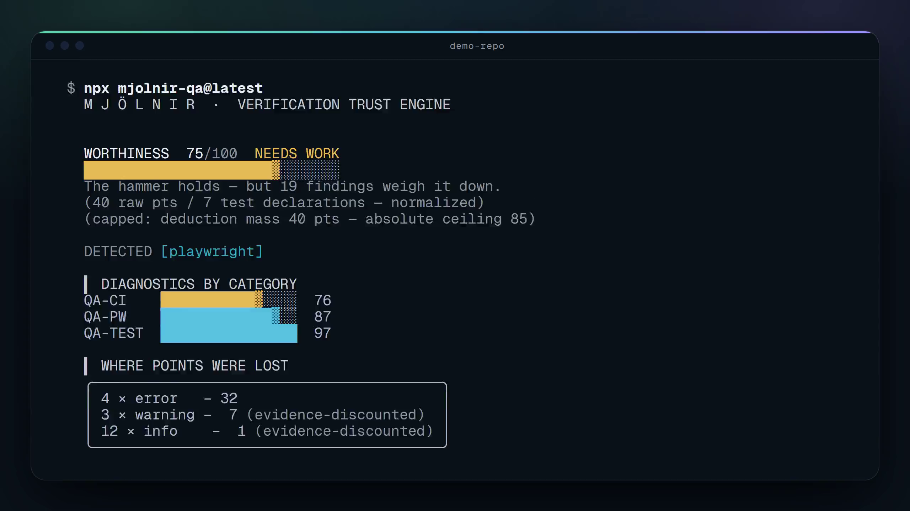

<div align="center">



<br />

Το QA Doctor βρίσκει τεστ που δεν μπορούν να αποτύχουν και pipelines που δεν μπορούν να γίνουν κόκκινα,<br />
και στη συνέχεια βαθμολογεί πόσο μπορεί να εμπιστευτεί κανείς το αποτέλεσμα, με το τεκμήριο για κάθε πόντο.

<br />

[](https://www.npmjs.com/package/qa-doctor-cli)
[](https://www.npmjs.com/package/qa-doctor-cli)
[](https://github.com/Sergey-Bar/qa-doctor/actions/workflows/ci.yml)
[](https://codecov.io/gh/Sergey-Bar/qa-doctor)
[](https://scorecard.dev/viewer/?uri=github.com/Sergey-Bar/qa-doctor)
[](LICENSE)
[](https://nodejs.org)

```bash
npx qa-doctor-cli@latest
```

[Δείτε το σε δράση](#δείτε-το-σε-δράση) · [Γρήγορη εκκίνηση](#γρήγορη-εκκίνηση) · [Τι βρίσκει](#τι-βρίσκει-το-qa-doctor) · [Βαθμολογία](#η-βαθμολογία-αξιοπιστίας) · [Τεκμήρια](#το-μοντέλο-τεκμηρίωσης) · [Ανάλυση εκτελέσεων](#ανάλυση-εκτελέσεων-τεστ) · [CI](#ακεραιότητα-ci) · [Πράκτορες](#πράκτορες-τν) · [Ασφάλεια](#εμπιστοσύνη-και-ασφάλεια) · [Όρια](#τι-δεν-μπορεί-να-σας-πει-το-qa-doctor) · [Τεκμηρίωση](#τεκμηρίωση)

<details>
<summary>Διαβάστε σε άλλη γλώσσα — 22 μεταφράσεις</summary>

[English](README.md) | [简体中文](README.zh.md) | [繁體中文](README.zht.md) | [한국어](README.ko.md) | [Deutsch](README.de.md) | [Español](README.es.md) | [Français](README.fr.md) | [Italiano](README.it.md) | [Dansk](README.da.md) | [日本語](README.ja.md) | [Polski](README.pl.md) | [Русский](README.ru.md) | [Norsk](README.no.md) | [Português (Brasil)](README.br.md) | [ไทย](README.th.md) | [Türkçe](README.tr.md) | [Українська](README.uk.md) | [বাংলা](README.bn.md) | Ελληνικά | [Tiếng Việt](README.vi.md) | [עברית](README.he.md) | [العربية](README.ar.md) | [Bosanski](README.bs.md)

> 🤖 Machine-assisted translation. The [English README](README.md) is canonical. Last synced: 2026-09-15.

<!-- Source hash: 3541b09e8d04 -->

</details>

</div>

<br />

## Ένα πράσινο τικ είναι ισχυρισμός, όχι απόδειξη

Ένα πράσινο τικ σημαίνει ότι το pipeline δεν απέτυχε. Δεν σημαίνει ότι τα τεστ εκτελέστηκαν ή ότι θα μπορούσαν να αποτύχουν. Κάθε ένα από αυτά περνά πράσινο:

- ένα `.only` σε commit που εκτέλεσε 3 τεστ αντί για 900
- `continue-on-error: true` στο job που έπρεπε να μπλοκάρει
- `|| true` μετά την εντολή των τεστ
- ένα τεστ που δεν ελέγχει τίποτα ή έχει άδειο σώμα
- ένα wrapper επαναλήψεων που μετατρέπει μια πραγματική αποτυχία σε τυχερή επιτυχία
- μια αναφορά που το workflow ανεβάζει αλλά δεν δημιούργησε ποτέ
- ένα σταθερό sleep που κρατά όρθια μια συνθήκη ανταγωνισμού

Κανένα δεν κάνει το pipeline κόκκινο, και το καθένα φαίνεται σκόπιμο στο review. Γι' αυτό επιβιώνουν. Ιδού το QA Doctor να διαβάζει ένα πραγματικό:

<p align="center">
  
</p>

<sub>Κάθε εύρημα που ανέφερε η σάρωση επίδειξης για αυτό το workflow, στη γραμμή που ανέφερε. Δημιουργείται με `npm run docs:readme-brand` από το [`demo-report.json`](assets/readme/demo-report.json) και κλειδώνεται έναντι αποκλίσεων στο CI.</sub>

**Αυστηρή λειτουργία.** Οι πιο επιθετικές ανιχνεύσεις — `.only`, `continue-on-error`, κενά τεστ, κατάχρηση επανάληψης — ζουν στο επίπεδο καραντίνας. Τρέχουν μόνο με `--strict` και περιορίζονται σε σοβαρότητα `info`: ειδοποιούν, δεν μπλοκάρουν ποτέ. Η προεπιλεγμένη σάρωση (`npx qa-doctor-cli@latest` χωρίς `--strict`) καλύπτει μόνο βασικούς και εκτεταμένους κανόνες. Προσθέστε `--strict` όταν θέλετε και το επίπεδο συμβουλών.

Το QA Doctor διαβάζει τη σουίτα, τα CI workflows και, αν υπάρχει, την αναφορά μιας πραγματικής εκτέλεσης. Δεν εκτελεί τα τεστ σας, δεν εγκαθιστά τις εξαρτήσεις σας και δεν εκτελεί τον κώδικα που σαρώνει. Κι όταν δεν έχει τεκμήρια, το λέει αντί να επινοεί βεβαιότητα:

| Κατάσταση                                               | Τι αναφέρει το QA Doctor                                                |
| ------------------------------------------------------- | ----------------------------------------------------------------------- |
| Δεν βρέθηκαν δηλώσεις τεστ                              | Βαθμολογία `null`, εμφανίζεται ως **UNKNOWN**. Ποτέ ένα επινοημένο 100. |
| Χωρίς baseline ή συγκρίσιμη αναθεώρηση                  | **UNKNOWN**, με ρητή αιτία. Ποτέ ένα υποτιθέμενο 0.                     |
| Η σάρωση διακόπηκε (χρονικό όριο, μη αναγνώσιμα αρχεία) | **PARTIAL**, έξοδος `2`. Ποτέ δεν παρουσιάζεται ως καθαρή.              |

<p align="center">
  
</p>

<sub>Σχεδιασμένο για αυτή τη σελίδα και εμφανίζεται σε κλίμακα 1:1. Δημιουργείται με `npm run docs:readme-brand` και κλειδώνεται έναντι αποκλίσεων στο CI· η βαθμολογία, οι μετρήσεις και το ID του κανόνα προέρχονται από τα [`script.demo.json`](assets/video/script.demo.json), [`demo-report.json`](assets/readme/demo-report.json) και το μητρώο κανόνων, ποτέ δεν πληκτρολογούνται με το χέρι. Η ίδια εικόνα ως αφίσα: [`architecture.svg`](assets/readme/architecture.svg).</sub>

<br />

## Δείτε το σε δράση

Μια πραγματική σάρωση του [`examples/demo-repo`](examples/demo-repo), μιας μικρής σουίτας Playwright με CI workflow. Εδώ πήγαν οι πόντοι της:

<p align="center">
  
</p>

<sub>Δημιουργείται με `npm run docs:hero` από πραγματική σάρωση και κλειδώνεται έναντι αποκλίσεων στο CI. Η πλήρης αναφορά `--verbose` της ίδιας σάρωσης είναι το [`demo.svg`](assets/readme/demo.svg) (`npm run docs:demo`).</sub>

<details>
<summary><strong>Δείτε το</strong> — μια σάρωση, η διόρθωση που τυπώνει και η νέα σάρωση που την αποδεικνύει</summary>

<br />

<p align="center">
  <a href="assets/video/qa-doctor-demo.mp4">
    
  </a>
</p>

<sub>Αποδόθηκε καρέ προς καρέ από πραγματική σάρωση με `npm run docs:video`· ποτέ δεν καταγράφηκε από την οθόνη. Επιλέξτε το καρέ για να ανοίξετε το [`qa-doctor-demo.mp4`](assets/video/qa-doctor-demo.mp4).</sub>

</details>

### Ένα εύρημα από κοντά

Κάθε εύρημα απαντά σε τέσσερα ερωτήματα: πού βρίσκεται, πόσο σίγουρο είναι το QA Doctor, πόσο συχνά κάνει λάθος ο κανόνας και πώς διορθώνεται.

<p align="center">
  
</p>

Το `qa-doctor explain QA-CI-001` τυπώνει ολόκληρο το ιστορικό εμπιστοσύνης ενός κανόνα, μαζί με το μετρημένο ποσοστό ψευδώς θετικών και το επίπεδο που του εξασφάλισε αυτό το ποσοστό:

```text
  ▍ QA-CI-001 — continue-on-error masks a failing verification gate

Severity:    error
Confidence:  high
Tier:        quarantine
Evidence:    E2
QA impact:   False-green risk (FALSE-GREEN)
Measured FP: 11% (19 hand-classified corpus verdicts)
FP risk:     low (author estimate)
Languages:   yaml
Frameworks:  github-actions, azure-pipelines

WHAT WAS FOUND (real detector output, not a mockup)
  Job `security-scan` runs a verification gate under `continue-on-error: true`.

WHY IT MATTERS
  This job can fail every day and CI will still show green. The checkmark on
  this workflow cannot be trusted.

HOW TO FIX
  Remove continue-on-error, or scope it to individual non-blocking steps only.

  Example from this rule's own must-fire fixture: QA-CI-001/must-fire/masked.yml

WHAT WOULD CHANGE THE VERDICT
  - a run report next to the scan target (qa-doctor.report.json or test-results/)
  corroborating this file lifts its findings to L3–L5
  - a documented suppression (qa-doctor.config.json) lowers the finding count
  without claiming correctness
  - quarantine findings run only under --strict and are advisory (E0) — they can
  never gate CI

NEXT ACTION
  Fix the first occurrence, then re-run: `qa-doctor --scope changed`. Every
  occurrence of this rule is listed in the scan output.

HOW TO VERIFY THE FIX
  Re-run `qa-doctor` on the changed file(s) — this finding should no longer
  appear. `qa-doctor --scope changed` scopes the check to just what you touched.

Docs: qa-doctor rules --md   (full catalog, this rule included)
```

Αυτή είναι η μονάδα αξίας: ένα σημείο όπου το CI αναφέρει μια επιτυχία που δεν κέρδισε.

<br />

## Γρήγορη εκκίνηση

```bash
npx qa-doctor-cli@latest
```

Σαρώνει τον τρέχοντα κατάλογο και τυπώνει το Trust Report: τι βρήκε, πόσο μπορείτε να το εμπιστευτείτε, γιατί και τι να κάνετε μετά. Τερματίζει με `0` όταν δεν βρέθηκε τίποτα στο επίπεδο της πύλης ή πάνω από αυτό.

Στο CI, σαρώστε μόνο ό,τι εισήγαγε το branch, ώστε μια παλιά σουίτα να μη πνίξει το πρώτο σας pull request:

```bash
npx qa-doctor-cli@latest --scope changed
```

Το `qa-doctor ci install` το γράφει ως GitHub Actions workflow, χρησιμοποιώντας το [action](https://github.com/Sergey-Bar/qa-doctor#readme) καρφιτσωμένο στο κύριο tag `v1` (ή απλό `npx` με `--no-action`). Παραμένει συμβουλευτικό μέχρι να αποφασίσετε ότι πρέπει να μπλοκάρει.

| Εντολή                                | Τι κάνει                                                            |
| ------------------------------------- | ------------------------------------------------------------------- |
| `qa-doctor`                           | Trust Report: ετυμηγορία, βεβαιότητα, επόμενη ενέργεια              |
| `qa-doctor --scope changed`           | Μόνο ό,τι εισήγαγε το branch σας (η μορφή για CI)                   |
| `qa-doctor ci install`                | Δημιουργεί το συμβουλευτικό workflow για PR (βασισμένο στο action)  |
| `qa-doctor explain QA-CI-001`         | Τι, γιατί και διόρθωση, συν το μετρημένο ποσοστό FP                 |
| `qa-doctor why src/a.spec.ts:42`      | Γιατί σημειώθηκε ακριβώς αυτή η γραμμή. Δεν μπλοκάρει ποτέ.         |
| `qa-doctor forensics ./test-results/` | Τεκμήρια χρόνου εκτέλεσης από πραγματική εκτέλεση                   |
| `qa-doctor trust-report`              | Αυτόνομο Trust Artifact (md + json)                                 |
| `qa-doctor handoff`                   | Σχέδιο αποκατάστασης για πράκτορα κώδικα                            |
| `qa-doctor --json` / `--format sarif` | Έξοδος αναγνώσιμη από μηχανές, GitHub Code Scanning                 |
| `qa-doctor --format codequality`      | Αναφορά GitLab Code Quality (artifact του widget του MR)            |
| `qa-doctor --strict`                  | Εκτελεί επίσης κανόνες επιπέδου quarantine (υψηλότερος κίνδυνος FP) |

<details>
<summary><strong>Όλες οι υπόλοιπες εντολές</strong> — διαλογή ασταθών τεστ, αναφορές, διακυβέρνηση</summary>

<br />

| Εντολή                                | Τι κάνει                                                                              |
| ------------------------------------- | ------------------------------------------------------------------------------------- |
| `qa-doctor --classic`                 | Το banner βαθμολογίας πριν από το Trust Report                                        |
| `qa-doctor explain verdict`           | Γιατί η ετυμηγορία της αποθηκευμένης σάρωσης είναι αυτή που είναι                     |
| `qa-doctor triage ./test-results/`    | Καθοδηγούμενη διαλογή. Κάθε γραμμή τελειώνει με μια επόμενη ενέργεια.                 |
| `qa-doctor pw-report ./test-results/` | Σύνοψη εκτέλεσης Playwright: επαναλήψεις, ασταθή τεστ, τα πιο αργά                    |
| `qa-doctor doctor:playwright`         | Βαθιά σάρωση μόνο για Playwright συν Selector Health Score                            |
| `qa-doctor fix --dry-run` / `fix`     | Ασφαλείς αυτόματες διορθώσεις, καθεμία ξανασαρωμένη για να αποδειχθεί ότι εφαρμόστηκε |
| `qa-doctor baseline` / `diff`         | Στιγμιότυπο των ευρημάτων, και μετά αναφορά μόνο των νέων ή χειρότερων                |
| `qa-doctor impact --since <ref>`      | Τι εισήγαγε και τι επέλυσε ένα commit                                                 |
| `qa-doctor summary`                   | Σημειώσεις CI και σύνοψη step από μια αναφορά                                         |
| `qa-doctor pr-comment`                | Ένα στοχευμένο σχόλιο PR, σε Markdown                                                 |
| `qa-doctor debt`                      | Μητρώο τεχνικού χρέους τεστ με μοντέλο κόστους                                        |
| `qa-doctor handover`                  | Χάρτης γνωριμίας με τη σουίτα για νέο μηχανικό QA                                     |
| `qa-doctor init`                      | Ανιχνεύει frameworks, τυπώνει λίστα ελέγχου ρύθμισης                                  |
| `qa-doctor suppressions`              | Εμφανίζει τα κατασταλμένα ευρήματα, για διακυβέρνηση                                  |
| `qa-doctor rules --unmeasured`        | Οι κανόνες που λειτουργούν με υπόθεση, όχι με μέτρηση                                 |
| `qa-doctor rules --md`                | Πλήρης κατάλογος κανόνων (JSON ή Markdown)                                            |
| `qa-doctor doctor`                    | Αυτοέλεγχος της βάσης κανόνων του ίδιου του QA Doctor                                 |
| `qa-doctor create-rule <ID>`          | Δημιουργεί σκελετό για νέο κανόνα και τα fixtures του                                 |
| `qa-doctor stats`                     | Τοπικοί μετρητές όλων των διορθώσεων που έχουν εμφανιστεί                             |
| `qa-doctor badge`                     | JSON endpoint του shields.io και απόσπασμα κώδικα                                     |
| `qa-doctor --cache`                   | Επαυξητικές νέες σαρώσεις μέσω τοπικής cache ετυμηγοριών                              |
| `qa-doctor --format mermaid`          | Διάγραμμα αρχιτεκτονικής τεστ για σχόλιο PR                                           |

Το `qa-doctor help <command>` τυπώνει τη χρήση, παραδείγματα και το επόμενο βήμα για οποιαδήποτε από αυτές.

</details>

Απαιτεί **Node.js ≥ 22.18** σε Windows, macOS ή Linux. Προτιμάτε καθολική εγκατάσταση; `npm i -g qa-doctor-cli`. Το ελάχιστο όριο προέρχεται από την αλυσίδα εργαλείων build (το tsdown το στοχεύει και το pipeline κυκλοφορίας κάνει smoke tests σε αυτό)· οι εξαρτήσεις χρόνου εκτέλεσης δεν χρειάζονται τίποτα περισσότερο.

<br />

## Τι βρίσκει το QA Doctor

<p align="center">
  
</p>

**79 κανόνες** σε τέσσερις οικογένειες — υγιεινή τεστ, ποιότητα τεστ, Playwright και ακεραιότητα CI — για TypeScript και JavaScript, Python, Java, C# και YAML του GitHub Actions. Καλύπτουν το Playwright και στα τέσσερα bindings, καθώς και pytest, JUnit, TestNG, NUnit, xUnit, MSTest, Jest, Vitest και Mocha, με αρχική κάλυψη για Cypress και Selenium. Εννέα από αυτούς, για να φανεί η μορφή:

| ID           | Κανόνας                                                                       | Σοβαρότητα | Επίπεδο    |
| ------------ | ----------------------------------------------------------------------------- | ---------- | ---------- |
| QA-CI-001    | Το `continue-on-error` κρύβει μια αποτυχημένη πύλη επαλήθευσης                | error      | quarantine |
| QA-CI-009    | Ο κωδικός εξόδου των τεστ δεν μεταφέρεται (`\|` χωρίς pipefail, αλυσίδες `;`) | error      | extended   |
| QA-TEST-001  | Εστιασμένο τεστ σε commit (`.only`, `fit`)                                    | error      | quarantine |
| QA-TEST-003  | Τεστ χωρίς ισχυρισμούς                                                        | error      | quarantine |
| QA-TQUAL-009 | Ισχυρισμός σε promise χωρίς await                                             | error      | quarantine |
| QA-PW-002    | Ισχυρισμός σε locator χωρίς await                                             | error      | core       |
| QA-PW-004    | Εύθραυστοι επιλογείς CSS/XPath                                                | warning    | quarantine |
| QA-PY-002    | Παραλειπόμενο τεστ (`skip`, μη αυστηρό `xfail`)                               | warning    | core       |
| QA-CS-103    | Μέθοδος τεστ χωρίς ισχυρισμούς                                                | error      | core       |

Ο πλήρης κατάλογος δημιουργείται από το μητρώο, ποτέ δεν συντηρείται με το χέρι: `qa-doctor rules --md`, [`docs/rules/`](docs/rules/) ή ο [οδηγός για το τι ελέγχει](https://sergey-bar.github.io/qa-doctor/guide/what-it-checks).

<details>
<summary><strong>Κάθε κανόνας που αναφέρεται σε αυτό το README</strong>, σε έναν πίνακα</summary>

<br />

> Οι κανόνες `quarantine` εκτελούνται μόνο με `--strict` και δεν μπλοκάρουν ποτέ (περιορίζονται σε info). Η σοβαρότητα που εμφανίζεται είναι αυτή που όρισε ο δημιουργός.

| ID           | Οικογένεια | Κανόνας                                                                 | Σοβαρότητα | Επίπεδο    |
| ------------ | ---------- | ----------------------------------------------------------------------- | ---------- | ---------- |
| QA-TEST-001  | Υγιεινή    | Εστιασμένο τεστ σε commit (`.only`, `fit`)                              | error      | quarantine |
| QA-TEST-002  | Υγιεινή    | Παραλειπόμενο τεστ. Κλιμακώνεται σε `error` χωρίς καταγεγραμμένη αιτία. | warning    | quarantine |
| QA-TEST-003  | Υγιεινή    | Τεστ χωρίς ισχυρισμούς                                                  | error      | quarantine |
| QA-TEST-004  | Υγιεινή    | Σταθερό sleep (`waitForTimeout`, `sleep()`, `delay()`)                  | warning    | extended   |
| QA-TEST-006  | Υγιεινή    | Κατάχρηση επαναλήψεων που κρύβει την αστάθεια                           | warning    | quarantine |
| QA-TEST-010  | Υγιεινή    | Άδειο σώμα τεστ                                                         | error      | quarantine |
| QA-TQUAL-002 | Ποιότητα   | Ταυτολογικός ισχυρισμός                                                 | error      | quarantine |
| QA-TQUAL-009 | Ποιότητα   | Ισχυρισμός σε promise χωρίς await                                       | error      | quarantine |
| QA-TQUAL-011 | Ποιότητα   | Τεστ σε σχόλια                                                          | warning    | extended   |
| QA-PW-002    | Playwright | Ισχυρισμός σε locator χωρίς await                                       | error      | core       |
| QA-PW-003    | Playwright | `page.pause()` / `test.only()` σε commit                                | error      | core       |
| QA-PW-004    | Playwright | Εύθραυστοι επιλογείς CSS/XPath                                          | warning    | quarantine |
| QA-PW-123    | Playwright | Σκληροκωδικοποιημένα URL περιβαλλόντων                                  | warning    | quarantine |
| QA-PW-140    | Playwright | Στιγμιότυπο οθόνης χωρίς `maxDiffPixelRatio`                            | warning    | core       |
| QA-CI-001    | CI         | Το `continue-on-error` κρύβει μια αποτυχημένη πύλη                      | error      | quarantine |
| QA-CI-002    | CI         | Το `\|\| true` καταπίνει κωδικούς εξόδου                                | error      | extended   |
| QA-CI-005    | CI         | Αναφορά που καταναλώνεται αλλά δεν δημιουργείται ποτέ                   | error      | quarantine |
| QA-CI-007    | CI         | Wrappers επαναλήψεων γύρω από τα τεστ                                   | warning    | extended   |
| QA-CI-008    | CI         | Step που πετυχαίνει πάντα κρύβει αποτυχίες                              | error      | quarantine |
| QA-CI-009    | CI         | Ο κωδικός εξόδου δεν μεταφέρεται (`\|` χωρίς pipefail, αλυσίδες `;`)    | error      | extended   |
| QA-CI-010    | CI         | Τεστ που παραλείπονται εκεί όπου πρέπει να μπλοκάρουν                   | error      | quarantine |
| QA-PY-002    | Python     | Παραλειπόμενο τεστ (`skip`, μη αυστηρό `xfail`)                         | warning    | core       |
| QA-PY-003    | Python     | Συνάρτηση τεστ χωρίς ισχυρισμούς                                        | error      | quarantine |
| QA-PY-005    | Python     | `time.sleep()` στα τεστ                                                 | warning    | extended   |
| QA-PY-012    | Python     | Ταυτολογικός ισχυρισμός                                                 | error      | quarantine |
| QA-JV-101    | Java       | Απενεργοποιημένο τεστ (`@Disabled`)                                     | warning    | core       |
| QA-JV-102    | Java       | Σταθερό sleep (`Thread.sleep()`)                                        | warning    | extended   |
| QA-JV-103    | Java       | Μέθοδος τεστ χωρίς ισχυρισμούς                                          | error      | extended   |
| QA-JV-105    | Java       | Σταθερό sleep με `waitForTimeout()` του Playwright                      | warning    | core       |
| QA-JV-106    | Java       | Εύθραυστος επιλογέας αντί για locator βάσει ρόλου                       | warning    | quarantine |
| QA-CS-101    | C#         | Παραλειπόμενο τεστ (`[Ignore]`, `[Fact(Skip=)]`)                        | warning    | core       |
| QA-CS-102    | C#         | Σταθερό sleep (`Thread.Sleep` / `Task.Delay`)                           | warning    | core       |
| QA-CS-103    | C#         | Μέθοδος τεστ χωρίς ισχυρισμούς                                          | error      | core       |
| QA-CS-105    | C#         | Σταθερό sleep με `WaitForTimeoutAsync()`                                | warning    | extended   |
| QA-CS-106    | C#         | Εύθραυστος επιλογέας αντί για locator βάσει ρόλου                       | warning    | quarantine |

Η Python περιλαμβάνει επίσης τους QA-PY-001…012 (υγιεινή pytest) και QA-PY-101…108 (Playwright για Python). Τα Cypress και Selenium έχουν αρχικά σύνολα τριών κανόνων το καθένα.

</details>

Κάθε κανόνας κυκλοφορεί με ένα fixture must-fire **και** ένα must-not-fire, και ένας κανόνας που ενεργοποιείται στο δικό του αρνητικό fixture δεν μπορεί να κυκλοφορήσει. Αυτό είναι το τείχος προστασίας από ψευδώς θετικά· το `qa-doctor doctor` το επιβάλλει στο CI αυτού του αποθετηρίου.

### Selector Health Score

Το `qa-doctor doctor:playwright` βαθμολογεί κάθε locator ανάλογα με το πώς βρίσκει ένα στοιχείο: όπως θα το έκανε ένας χρήστης (ρόλος, ετικέτα, κείμενο), μέσω ρητού συμβολαίου (`data-testid`) ή από δομική σύμπτωση (αλυσίδες CSS, XPath). Κάθε αρχείο παίρνει βαθμολογία από 0 έως 100:

```text
  ▍ SELECTOR HEALTH

e2e/login.spec.ts
  [█████████████░░░░░░░]  65 / 100
  role/text: 1 · testid: 0 · plain-css: 0 · css-chains: 1 ⚠ · xpath: 0

e2e/checkout.spec.ts
  [██████████████████░░]  88 / 100
  role/text: 4 · testid: 1 · plain-css: 0 · css-chains: 1 ⚠ · xpath: 0
```

Αυτό μετρά **ανθεκτικότητα, όχι ορθότητα**. Το `.btn.btn-primary > div:nth-child(2)` περνά σήμερα και θα συνεχίσει να περνά μέχρι κάποιος να αγγίξει το markup. Μια χαμηλή βαθμολογία δεν ισχυρίζεται ποτέ ότι το τεστ είναι χαλασμένο, μόνο ότι εξαρτάται από markup που κανείς δεν υποσχέθηκε να διατηρήσει.

<br />

## Η βαθμολογία αξιοπιστίας

<p align="center">
  
</p>

<sub>Κάθε βαθμολογία από 0 έως 100, τοποθετημένη από το πραγματικό `deriveScoreState`. Δημιουργείται με `npm run docs:gauge` και κλειδώνεται έναντι αποκλίσεων στο CI.</sub>

| Βαθμολογία | Ετυμηγορία                              |
| ---------- | --------------------------------------- |
| `0 – 49`   | **UNWORTHY**                            |
| `50 – 79`  | **NEEDS WORK**                          |
| `80 – 99`  | **WORTHY**                              |
| `100`      | **FORGED**                              |
| `null`     | **UNKNOWN**: δεν βρέθηκαν δηλώσεις τεστ |

**Πώς υπολογίζεται.** Η σοβαρότητα ορίζει μια βασική αφαίρεση (`error −8`, `warning −3`, `info −1`) και το επίπεδο τεκμηρίωσης τη μειώνει: το E2 μετρά πλήρως, το E1 κατά το ήμισυ (με στρογγυλοποίηση προς τα κάτω), το E0 καθόλου. Το σύνολο κανονικοποιείται με βάση την έκθεση της σουίτας, δηλαδή αφαιρέσεις ανά δήλωση τεστ αντί ανά αρχείο. Το τερματικό τυπώνει τους ίδιους μειωμένους αριθμούς που χρησιμοποίησε η βαθμολογία· δεν υπάρχει κρυφό δεύτερο μοντέλο. Λεπτομέρειες: [docs/SCORING.md](docs/SCORING.md) και ο [οδηγός βαθμολόγησης](https://sergey-bar.github.io/qa-doctor/guide/scoring).

**Τι δεν σημαίνει το 100.** Δεν σημαίνει ότι το λογισμικό είναι σωστό, ότι η σουίτα επαρκεί ή ότι το προϊόν είναι απαλλαγμένο από ελαττώματα. Σημαίνει ένα πράγμα: **κανένας από τους κανόνες που αξιολόγησε το QA Doctor δεν παρήγαγε αφαίρεση σε αυτή τη σάρωση και με αυτό το μοντέλο τεκμηρίωσης.**

<br />

## Το μοντέλο τεκμηρίωσης

Κάθε εύρημα φέρει δύο ετικέτες: πόσο σίγουρο είναι το QA Doctor και πόσο έχει ελεγχθεί το εύρημα. Αυτή είναι η διαφορά ανάμεσα σε ένα εργαλείο που αναφέρει μοτίβα και σε ένα εργαλείο στο οποίο μπορείτε να εξαρτήσετε μια κυκλοφορία.

**Πόσο σίγουρο — το επίπεδο τεκμηρίωσης.**

| Επίπεδο | Όνομα                    | Σημαίνει                                                  | Αφαίρεση |
| ------- | ------------------------ | --------------------------------------------------------- | -------- |
| **E2**  | Ντετερμινιστική απόδειξη | Το ελάττωμα υπάρχει στον κώδικα όπως είναι γραμμένος      | Πλήρης   |
| **E1**  | Τεκμήριο μοτίβου         | Ταίριαξε ένα μοτίβο στενά συνδεδεμένο με το ελάττωμα      | Μισή     |
| **E0**  | Παρατήρηση               | Αξίζει να το ξέρετε. Όχι ισχυρισμός ότι κάτι είναι λάθος. | Μηδέν    |

Η βεβαιότητα μιας ανίχνευσης δεν είναι η ισχύς της απόδειξης. Ένας κανόνας μπορεί να είναι βέβαιος ότι βρήκε αυτό που έψαχνε και παρ' όλα αυτά να κοιτάζει μια ευρετική. Τα ευρήματα E1 υπάρχουν για να διαβάζονται και να κρίνονται, ποτέ για να εφαρμόζονται στα τυφλά, και αυτό το όριο είναι αποτυπωμένο στο εύρημα στο τερματικό, στο JSON και στην παράδοση στον πράκτορα.

**Πόσο ελέγχθηκε — το επίπεδο εμπιστοσύνης.** Τα περισσότερα ευρήματα προκύπτουν από την ανάγνωση του κώδικά σας. Δώστε στο QA Doctor την αναφορά μιας πραγματικής εκτέλεσης τεστ και μπορεί να επιβεβαιώσει ότι ο κώδικας όντως εκτελέστηκε.

<p align="center">
  
</p>

| Επίπεδο | Με απλά λόγια             | Τι χρειάζεται                                                                  |
| ------- | ------------------------- | ------------------------------------------------------------------------------ |
| **L0**  | Σημειώθηκε                | Ανάγνωση του κώδικα                                                            |
| **L1**  | Μοιάζει με το πρόβλημα    | Ανάγνωση του κώδικα: ταίριαξε ένα μοτίβο                                       |
| **L2**  | Αποδεδειγμένο στον κώδικα | Ανάγνωση του κώδικα: το ελάττωμα είναι δομικό                                  |
| **L3**  | Το αρχείο εκτελέστηκε     | Μια αναφορά εκτέλεσης δείχνει ότι το αρχείο του ευρήματος εκτελέστηκε          |
| **L4**  | Το τεστ εκτελέστηκε       | Μια αναφορά εκτέλεσης δείχνει ότι το τεστ του ευρήματος εκτελέστηκε            |
| **L5**  | Η εκτέλεση συμφωνεί       | Το ίδιο το αποτέλεσμα της εκτέλεσης επιβεβαιώνει την κατηγορία του ελαττώματος |

Μια στατική σάρωση σταματά στο L2. Μόνο μια πραγματική αναφορά εκτέλεσης (Playwright JSON, Jest ή Vitest JSON, JUnit XML) μπορεί να ανεβάσει ένα εύρημα στο L3 ή παραπάνω, οπότε ένα εύρημα που δεν εθεάθη ποτέ να εκτελείται δεν μπορεί ποτέ να ισχυριστεί ότι εκτελέστηκε. Ορισμοί: [docs/TERMINOLOGY.md](docs/TERMINOLOGY.md).

### Πόσο από αυτό είναι μετρημένο

**74 από 79 κανόνες έχουν ποσοστό ψευδώς θετικών μετρημένο σε πραγματικό κώδικα OSS** (τουλάχιστον 10 ευρήματα ταξινομημένα με το χέρι ο καθένας· δείτε το [docs/FP-AUDIT.md](docs/FP-AUDIT.md)). Οι υπόλοιποι 5 βασίζονται στην εκτίμηση του δημιουργού και το δηλώνουν, κανόνα προς κανόνα, στο `qa-doctor explain`. Το `qa-doctor rules --unmeasured` τους απαριθμεί, και το υποσέλιδο κάθε σάρωσης αναφέρει πόσοι από τους κανόνες που πράγματι _ενεργοποιήθηκαν_ είναι μετρημένοι.

Τα ποσοστά παραμένουν δημόσια ακόμη κι όταν είναι κακά. Ο QA-TEST-001 (ένα `.only` σε commit) τα πάει άσχημα στον έλεγχο σε πραγματικά αποθετήρια και γι' αυτό βρίσκεται σε quarantine. Ο τρέχων αριθμός για κάθε κανόνα, μαζί με τον QA-PW-141, βρίσκεται στον έλεγχο.

### Επίπεδα εμπιστοσύνης κανόνων

Τα επίπεδα ακολουθούν το μετρημένο ποσοστό ψευδώς θετικών, όχι γνώμες:

| Επίπεδο         | Μετρημένο FP          | Συμπεριφορά                                               |
| --------------- | --------------------- | --------------------------------------------------------- |
| **core**        | ≤ 10%                 | Προεπιλεγμένη αναφορά, μπλοκάρει                          |
| **extended**    | ≤ 30%                 | Προεπιλεγμένη αναφορά, χαμηλότερη βεβαιότητα              |
| **quarantine**  | > 30% ή ρητά δηλωμένο | Μόνο `--strict`, περιορισμένο σε info, δεν μπλοκάρει ποτέ |
| _μη μετρημένος_ | n < 10                | Δεν μπορεί να προαχθεί σε core μέχρι να μετρηθεί          |

Οι ζώνες FP μπορούν μόνο να υποβιβάσουν ένα επίπεδο — δεν προάγουν ποτέ έναν κανόνα εκτός `quarantine` αν έχει δηλωθεί ρητά εκεί. Ένας ρητά τεθείς σε καραντίνα κανόνας παραμένει στο quarantine ανεξαρτήτως του μετρημένου ποσοστού FP.

Προαγωγή, υποβιβασμός και ωριμότητα ανά γλώσσα: [κύκλος ζωής των κανόνων](https://sergey-bar.github.io/qa-doctor/reference/rule-lifecycle).

### Γιατί αυτό δεν είναι linter

Οι linters σάς λένε αν ο κώδικας ακολουθεί κανόνες. Το QA Doctor σάς λέει αν μπορείτε να εμπιστευτείτε την επαλήθευσή σας.

|                                                                            | Linters (ESLint, SonarQube) | Εργαλεία κάλυψης | Έλεγχος κώδικα με ΤΝ |   **QA Doctor**    |
| -------------------------------------------------------------------------- | :-------------------------: | :--------------: | :------------------: | :----------------: |
| Βαθμολογεί το **σύστημα επαλήθευσης**, όχι τον κώδικα του προϊόντος        |             Όχι             |       Όχι        |         Όχι          |        Ναι         |
| Ακεραιότητα των CI workflows (`continue-on-error`, `\|\| true`)            |             Όχι             |       Όχι        |     μόνο το diff     |        Ναι         |
| Βαθμολογεί την ανθεκτικότητα των locators του Playwright (Selector Health) |             Όχι             |       Όχι        |         Όχι          |        Ναι         |
| Διαβάζει πραγματικά δεδομένα εκτελέσεων για ετυμηγορίες `TRUE-FLAKE`       |             Όχι             |       Όχι        |         Όχι          |        Ναι         |
| Δημοσιεύει μετρημένο ποσοστό ψευδώς θετικών ανά κανόνα                     |             Όχι             |       Όχι        |         Όχι          |        Ναι         |
| Σημειώνει τεστ χωρίς ισχυρισμούς                                           |            Ναι\*            |       Όχι        |    μερικές φορές     |        Ναι         |
| Εντοπίζει σταθερά sleep (`waitForTimeout`, `time.sleep`)                   |            Ναι\*            |       Όχι        |    μερικές φορές     |        Ναι         |
| Ντετερμινιστικό (ίδια είσοδος, ίδια έξοδος)                                |             Ναι             |       Ναι        |         Όχι          |        Ναι         |
| Κόστος ανά σάρωση                                                          |           δωρεάν            |      δωρεάν      |        tokens        | **μηδέν** (τοπικά) |

<sub>\*Καλύπτεται από τα `eslint-plugin-jest` και `eslint-plugin-playwright` (`expect-expect`, `no-wait-for-timeout`) και από τους δικούς κανόνες ισχυρισμών του SonarQube. Οι στήλες περιγράφουν την προεπιλεγμένη συμπεριφορά για την επαλήθευση σουιτών τεστ· πρόσθετα, επί πληρωμή πλάνα και προσαρμοσμένοι κανόνες αλλάζουν ορισμένες απαντήσεις. Αυτή είναι μια σύνοψη τοποθέτησης, όχι benchmark.</sub>

Χρησιμοποιήστε και έλεγχο με ΤΝ. Πιάνει αποχρώσεις, πρόθεση και σχεδιαστικά λάθη που κανένα μοτίβο δεν μπορεί να βρει. Το QA Doctor πιάνει ό,τι ξεφεύγει από τον έλεγχο με ΤΝ επειδή φαίνεται σκόπιμο: ένα `.only` σε commit, έναν καταπιωμένο κωδικό εξόδου, ένα `continue-on-error` σε job τεστ. Αυτά χρειάζονται σάρωση, όχι συλλογισμό.

<br />

## Ανάλυση εκτελέσεων τεστ

Η στατική ανάλυση συλλογίζεται για κώδικα που δεν εκτελέστηκε ποτέ. Η ανάλυση εκτελέσεων διαβάζει τι πραγματικά συνέβη: Playwright JSON, Jest JSON, Vitest JSON και JUnit XML από οποιονδήποτε runner.

```bash
qa-doctor forensics ./test-results/
```

```text
  ▍ FLAKINESS LEADERBOARD

3 tests · 1 failed · 1 flaky · 1 retried

TRUE-FLAKE completes checkout with saved card (e2e/checkout.spec.ts)
           ████████████████████ 6.0s · 2 attempts
FAILING    declines an expired card (e2e/checkout.spec.ts)
           ████░░░░░░░░░░░░░░░░ 1.1s · 1 attempt
```

Το `TRUE-FLAKE` δεν σημαίνει ότι το τεστ επαναλήφθηκε. Σημαίνει ότι το τεστ **απέτυχε σε τουλάχιστον μία προσπάθεια και μετά τελείωσε πράσινο**: μια τυχερή επιτυχία, που σημειώνεται ό,τι κι αν λέει το τελικό τικ. Το `qa-doctor triage` μετατρέπει αυτό το ιστορικό σε πρόταση καραντίνας και το `qa-doctor pw-report` συνοψίζει μια εκτέλεση. Οι ίδιες αναφορές εκτέλεσης είναι αυτές που ανεβάζουν τα ευρήματα στα επίπεδα εμπιστοσύνης L3 και πάνω.

<br />

## Ακεραιότητα CI

Ένα τεστ μπορεί να περνά ενώ το pipeline γύρω του δεν μπορεί να αποτύχει. Το QA Doctor διαβάζει και τα workflows: `continue-on-error`, `|| true`, κωδικούς εξόδου που δεν μεταφέρονται ποτέ, steps που πετυχαίνουν πάντα, αναφορές που καταναλώνονται αλλά δεν δημιουργούνται ποτέ, και πύλες που παραλείπονται ακριβώς στα γεγονότα που θα έπρεπε να μπλοκάρουν. Κάθε εύρημα κατονομάζει το job, το step και τη γραμμή, και φέρει το δικό του επίπεδο τεκμηρίωσης.

Δημιουργήστε το workflow για PR, συμβουλευτικό από προεπιλογή:

```bash
qa-doctor ci install
```

Ή προσθέστε το action του Marketplace σε ένα workflow που ήδη έχετε:

```yaml
- uses: Sergey-Bar/qa-doctor@v1
  with:
    scope: changed
    fail-on: error
```

Καρφιτσώστε το `@v1` για να ακολουθείτε την κύρια γραμμή, ή ένα ακριβές tag (`@v0.5.32`) για αναπαραγώγιμη πύλη. Το [docs/DISTRIBUTION-KIT.md](docs/DISTRIBUTION-KIT.md) καλύπτει το Marketplace, το Smithery και τα μητρώα MCP.

Για να στείλετε τα ευρήματα στο GitHub Code Scanning, ανεβάστε SARIF (απαιτεί `security-events: write` σε επίπεδο workflow ή job):

```yaml
- run: npx qa-doctor-cli@latest --format sarif > qa-doctor.sarif
  continue-on-error: true
- uses: github/codeql-action/upload-sarif@v3
  if: ${{ !cancelled() }}
  with:
    sarif_file: qa-doctor.sarif
```

Στο GitLab, το `--format codequality` γράφει την αναφορά Code Quality που διαβάζουν το widget του MR και οι σημειώσεις του diff ([docs/GITLAB-CI.md](docs/GITLAB-CI.md)). Ρύθμιση επεξεργαστή και pipeline: [docs/SARIF-INTEGRATION.md](docs/SARIF-INTEGRATION.md).

### Απόδοση στο εύρος των αλλαγών

```bash
npx qa-doctor-cli@latest --scope changed
```

Τα ευρήματα αποδίδονται στις γραμμές που πρόσθεσε το branch σας, μετρημένες ως προς το **merge-base**. Το εύρος είναι το ίδιο σύνολο αρχείων που ανακαλύπτει μια πλήρης σάρωση (specs TS/JS και ρυθμίσεις adapters, `test_*.py`, `*Test.java`, `*Tests.cs`, `.github/workflows/*.yml`), συν τις αλλαγές χωρίς commit και τις μη παρακολουθούμενες, οπότε λειτουργεί πριν κάνετε commit. Η βάση επιλύεται με τη σειρά `main → master → origin/main → origin/master → origin/HEAD`· αντικαταστήστε τη με `--base <ref>`.

Όταν το merge-base δεν μπορεί να επιλυθεί (ρηχός κλώνος, αποσυνδεδεμένο HEAD, στόχος εκτός git), τα ευρήματα επιστρέφουν σε απόδοση σε ολόκληρο το αρχείο **και η αναφορά το λέει.** Μια σιωπηλή εναλλακτική θα ήταν ακριβώς το είδος ελαττώματος που υπάρχει αυτό το εργαλείο για να πιάνει.

<br />

## Πράκτορες ΤΝ

Τα ευρήματα αξίζουν κάτι μόνο αν κάτι ενεργεί με βάση αυτά.

```text
SCAN → EVIDENCE → HANDOFF → AGENT → RE-SCAN → PROOF
```

**Η ΤΝ γράφει τη διόρθωση. Το QA Doctor την επαληθεύει.** Η απόδειξη προέρχεται από τη νέα σάρωση, ποτέ από την αναφορά επιτυχίας του ίδιου του πράκτορα.

| Εντολή              | Τι παίρνει ο πράκτορας                                                                                                                                                          |
| ------------------- | ------------------------------------------------------------------------------------------------------------------------------------------------------------------------------- |
| `qa-doctor mcp`     | Ένας διακομιστής [MCP](https://modelcontextprotocol.io) μέσω stdio. Τα `scan`, `explain` και `diff` γίνονται εργαλεία που καλούνται.                                            |
| `qa-doctor handoff` | Μια αποθηκευμένη αναφορά `--json` γίνεται ντετερμινιστικό σχέδιο σε Markdown: τι εντοπίστηκε, το όριο τεκμηρίωσης ανά εύρημα, τι **δεν** πρέπει να αλλάξει, πώς να επαληθευτεί. |
| `qa-doctor install` | Γράφει στις επιφάνειες πρακτόρων που ήδη έχει το αποθετήριό σας (`.claude/`, `.cursor/`, `.kilo/`, `AGENTS.md`), ώστε ο πράκτορας να ξανασαρώνει πριν δηλώσει ότι τελείωσε.     |

Προσθέστε το σε έναν client που έχει δικό του CLI:

```bash
claude mcp add qa-doctor -- npx -y qa-doctor-cli@latest mcp
```

Ή σε οποιονδήποτε client δέχεται ένα μπλοκ `mcpServers`:

```json
{
  "mcpServers": {
    "qa-doctor": {
      "command": "npx",
      "args": ["-y", "qa-doctor-cli@latest", "mcp"]
    }
  }
}
```

**Το προστατευτικό κιγκλίδωμα μετράει περισσότερο από την ευκολία.** Κάθε εύρημα σε μια παράδοση φέρει το όριό του. Το **E2** λέει _ντετερμινιστικό: ελέγξτε τη θέση και εφαρμόστε τη διόρθωση_. Το **E1** λέει _ΑΠΑΙΤΕΙΤΑΙ ΕΠΙΒΕΒΑΙΩΣΗ: η παρατήρηση από μόνη της δεν αποδεικνύει το ελάττωμα_. Ένας πράκτορας που διορθώνει τυφλά ένα E1, καταστέλλει έναν κανόνα ή τροποποιεί έναν κανόνα για να ανεβάσει τη βαθμολογία κάνει ακριβώς αυτό που υπάρχει αυτό το εργαλείο για να πιάνει, γι' αυτό η παράδοση το λέει στο prompt, δίπλα στο εύρημα.

<br />

## Εμπιστοσύνη και ασφάλεια

**Τοπικά πρώτα, μηδενική τηλεμετρία.** Κανένα API με δυνατότητα δικτύου (`fetch`, `http`, `https`, `net`, `dns`, `dgram`, WebSocket) δεν υπάρχει πουθενά στο `src/`, και το [`privacy-network-isolation.spec.ts`](tests/contract/privacy-network-isolation.spec.ts) αποτυγχάνει το build αν εμφανιστεί κάποιο. Απαγορεύει επίσης τα `eval` και `new Function`. Η σάρωση μη αξιόπιστου κώδικα δεν τον εκτελεί ποτέ: η στατική ανάλυση διαβάζει πηγαίο κείμενο και η ανάλυση εκτελέσεων αναλύει αρχεία αναφορών που ήδη υπάρχουν στον δίσκο.

Δύο επιφυλάξεις: το ίδιο το `npx` κατεβάζει το πακέτο πριν εκτελεστεί οτιδήποτε, και η εγγύηση καλύπτει το `src/`, όχι πρόσθετα τρίτων.

**Τα πρόσθετα δεν εκτελούνται σε sandbox.** Τα πρόσθετα JS (`qa-doctor-rules/*.mjs` ή πακέτα npm που αναφέρονται στο `"plugins"`) εκτελούνται με πλήρη δικαιώματα Node, με το ίδιο μοντέλο εμπιστοσύνης όπως τα πρόσθετα του ESLint ή του Vitest. Η φόρτωσή τους είναι ρητή επιλογή **ανά σάρωση**: χωρίς `--enable-plugins` (ή `QA_DOCTOR_ENABLE_PLUGINS=1`) οι πηγές τους δεν φορτώνονται ποτέ, και μια ειδοποίηση στο stderr απαριθμεί τι παραλείφθηκε. Τα manifests κανόνων σε JSON δεν εκτελούν κώδικα, και τα προθέματα ID των κανόνων core είναι δεσμευμένα, ώστε κανένα πρόσθετο να μην μπορεί να υποδυθεί κάποιον. Αναφέρετε ευπάθειες μέσω του [SECURITY.md](SECURITY.md).

**Εκτελείται πάνω στον εαυτό του.** Μια μηχανή εμπιστοσύνης επαλήθευσης δεν έχει καμία αξιοπιστία αν δεν είναι η ίδια επαληθεύσιμη. Κάθε εκτέλεση του CI σαρώνει αυτό το αποθετήριο με το build που παρήγαγε η ίδια εκτέλεση. Η πύλη αποτυγχάνει σε οποιοδήποτε εύρημα σοβαρότητας error, καθώς και σε **μερική** σάρωση ή σε **κανόνα που κατέρρευσε**, γιατί μια κομμένη αυτοσάρωση που δεν αναφέρει τίποτα είναι ακριβώς το ψεύτικο πράσινο που υπάρχει αυτό το έργο για να πιάνει. Το `qa-doctor doctor` ελέγχει ξανά τη βάση κανόνων στην ίδια εκτέλεση (τείχος προστασίας fixtures, ειλικρίνεια επιπέδων, το ανώτατο όριο του επιπέδου core), και ένας έλεγχος με αποτέλεσμα INCONCLUSIVE αποτυγχάνει ακριβώς όπως ένας αποτυχημένος. Και οι δύο αναφορές ανεβαίνουν ως artifacts του build.

### Κωδικοί εξόδου και το συμβόλαιο μηχανής

Παγωμένοι, ώστε να μπορείτε να χτίσετε λογική CI πάνω τους:

| Κωδικός εξόδου | Σημασία                                                                                |
| -------------- | -------------------------------------------------------------------------------------- |
| `0`            | Καθαρό: κανένα εύρημα στο επίπεδο της πύλης ή πάνω από αυτό                            |
| `1`            | Ευρήματα στο επίπεδο της πύλης ή πάνω από αυτό                                         |
| `2`            | Μερική σάρωση (εξαντλήθηκε το χρονικό όριο, μη αναγνώσιμα αρχεία). Δεν μπλοκάρει ποτέ. |
| `10`           | Σφάλμα χρήσης (λάθος σημαία, λείπει ο στόχος)                                          |
| `20`           | Εσωτερικό σφάλμα                                                                       |

Το `2` είναι σκόπιμα διαφορετικό από το `0`: μια σάρωση που δεν ολοκληρώθηκε δεν «βρήκε τίποτα». Απλώς δεν τελείωσε την αναζήτηση.

Ό,τι καταναλώνει μια μηχανή (αποτελέσματα εργαλείων MCP, `--json`, SARIF 2.1) προέρχεται από ένα κανονικό αποτέλεσμα με εκδοσιοποιημένο σχήμα που **μόνο επεκτείνεται** (`schemaVersion: 1`, `contractVersion: 1`), ώστε κανένας καταναλωτής να μη χρειάζεται να ανασυνθέτει το νόημα από αποδοσμένο κείμενο. Δείτε [το συμβόλαιο μηχανής](docs/machine-contract.md). Τα ID κανόνων (`QA-<FAMILY>-NNN`) είναι αμετάβλητα μόλις κυκλοφορήσουν και δεν επαναχρησιμοποιούνται ποτέ.

<br />

## Τι δεν μπορεί να σας πει το QA Doctor

- **Δεν εκτελεί τα τεστ σας.** Μια καθαρή σάρωση δεν είναι μια σουίτα που περνά.
- **Δεν μπορεί να σας πει ότι ένας ισχυρισμός είναι _λάθος_.** Το `expect(total).toBe(41)` φαίνεται υγιές. Το QA Doctor βρίσκει τεστ που _δεν μπορούν να αποτύχουν_ και pipelines που _δεν μπορούν να γίνουν κόκκινα_, όχι τεστ που ελέγχουν το λάθος πράγμα.
- **Δεν αποδεικνύει την επιχειρησιακή ορθότητα.** Τίποτα εδώ δεν λέει ότι το προϊόν σας κάνει αυτό που ζητούσε η απαίτηση.
- **Ένα 100 δεν αποδεικνύει μια καλή σουίτα.** Το αν η σουίτα σας καλύπτει τον πραγματικό σας κίνδυνο είναι άλλο ερώτημα, και αυτό το εργαλείο δεν το απαντά.
- **5 από 79 κανόνες βασίζονται σε εκτίμηση**, όχι σε μετρημένο ποσοστό. Ο καθένας το δηλώνει στο δικό του εύρημα.
- **Το E1 δεν είναι E2.** Τα ευρετικά ευρήματα αξίζει να διαβάζονται, όχι να εφαρμόζονται στα τυφλά.
- **Ένα άδειο αποθετήριο παίρνει `null`, ποτέ 100.**
- **Ένα αρχείο με όνομα `*.spec.ts` χωρίς δηλώσεις τεστ δεν μετρά ως κάλυψη.** Ένα αποθετήριο του οποίου τα μόνα αρχεία spec περιέχουν imports ή τύπους (μηδέν κλήσεις `it`/`test`) παίρνει `null`, όχι 100.

<br />

## Τεκμηρίωση

Ο πλήρης ιστότοπος τεκμηρίωσης βρίσκεται στο <https://sergey-bar.github.io/qa-doctor/>.

| Έγγραφο                                                | Τι περιέχει                                           |
| ------------------------------------------------------ | ----------------------------------------------------- |
| [docs/SCORING.md](docs/SCORING.md)                     | Κανονικοποίηση βαθμολογίας και στάθμιση τεκμηρίων     |
| [docs/TERMINOLOGY.md](docs/TERMINOLOGY.md)             | Κανονικό λεξιλόγιο: μία λέξη ανά έννοια               |
| [docs/FP-AUDIT.md](docs/FP-AUDIT.md)                   | Μετρημένα ποσοστά ψευδώς θετικών και η μέθοδος        |
| [docs/RULE-LIFECYCLE.md](docs/RULE-LIFECYCLE.md)       | Καταστάσεις κανόνων, επίπεδα, καταστολή, απόσυρση     |
| [docs/VERSIONING.md](docs/VERSIONING.md)               | Πολιτική semver, παγωμένες διεπαφές, κύκλος απόσυρσης |
| [docs/machine-contract.md](docs/machine-contract.md)   | Το κανονικό αποτέλεσμα αναγνώσιμο από μηχανές         |
| [docs/SARIF-INTEGRATION.md](docs/SARIF-INTEGRATION.md) | Έξοδος SARIF και ρύθμιση επεξεργαστή ή CI             |
| [docs/GITLAB-CI.md](docs/GITLAB-CI.md)                 | GitLab: αναφορά Code Quality, συνταγή για MR, πύλη    |
| [docs/rules/](docs/rules/)                             | Παραγόμενος κατάλογος ανά κανόνα                      |
| [CONTRIBUTING.md](CONTRIBUTING.md)                     | Περιβάλλον ανάπτυξης και ροή συνεισφοράς              |
| [SUPPORT.md](SUPPORT.md)                               | Πού να ρωτήσετε, να αναφέρετε και να βρείτε βοήθεια   |
| [SECURITY.md](SECURITY.md)                             | Αναφορά ευπαθειών                                     |
| [CHANGELOG.md](CHANGELOG.md)                           | Ιστορικό εκδόσεων                                     |

### Κατάσταση

**Έκδοση 1.** Το σχήμα JSON και οι κωδικοί εξόδου είναι παγωμένα συμβόλαια. Οι TypeScript και Python έχουν την ευρύτερη μετρημένη κάλυψη. Οι Java και C# είναι νεότερες· διαβάστε τις μέσα από τον [πίνακα ωριμότητας](https://sergey-bar.github.io/qa-doctor/reference/rule-lifecycle). Τι έρχεται μετά, χωρίς επινοημένες ημερομηνίες: [ο δημόσιος οδικός χάρτης](https://sergey-bar.github.io/qa-doctor/reference/roadmap).

### Συνεισφορά

Οι νέοι κανόνες είναι η ευκολότερη πρώτη συνεισφορά. Μία εντολή δημιουργεί τον σκελετό του κανόνα με τα fixtures must-fire **και** must-not-fire. Ο κανόνας που δημιουργείται αποτυγχάνει σκόπιμα στα δικά του fixtures μέχρι να γραφτεί πραγματική ανίχνευση, γιατί ένα stub που κυκλοφορεί είναι ένας κανόνας που κανείς δεν μέτρησε:

```bash
qa-doctor create-rule QA-PW-140 --title "Screenshot without diff bound"
```

Το περιβάλλον ανάπτυξης, οι εντολές των μόνιμων πυλών και οι νόμοι anti-creep και τείχους προστασίας fixtures βρίσκονται στο [CONTRIBUTING.md](CONTRIBUTING.md).

<br />

<div align="center">


```bash
npx qa-doctor-cli@latest
```

[Διαβάστε τον οδηγό](https://sergey-bar.github.io/qa-doctor/guide/getting-started) · [Ιστότοπος τεκμηρίωσης](https://sergey-bar.github.io/qa-doctor/) · [npm](https://www.npmjs.com/package/qa-doctor-cli)

<br />

Μη ρωτάτε αν πέρασαν τα τεστ.<br />
Ρωτήστε αν τα τεκμήρια αποδεικνύουν ότι αξίζουν εμπιστοσύνη.

<sub>Δημιουργήθηκε από τον [Sergey Bar](https://www.linkedin.com/in/sergeybar/) · Άδεια MIT</sub>

</div>
