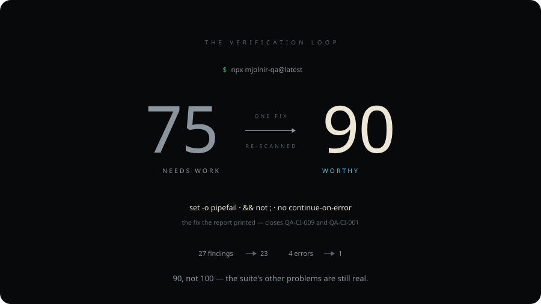

<div align="center">


### Tests tell you what passed. Mjölnir tells you what you can trust.

**Mjölnir is a Verification Trust Engine.** Test frameworks verify your
software. Mjölnir verifies the system that does the verifying — the test
suite, the run artifacts and the CI pipeline — and reports a worthiness
score with the evidence behind every deduction.

[](https://www.npmjs.com/package/mjolnir-qa)
[](https://www.npmjs.com/package/mjolnir-qa)
[](https://github.com/Sergey-Bar/Mjolnir/actions/workflows/ci.yml)
[](LICENSE)
[](https://nodejs.org)

```bash
npx mjolnir-qa@latest
```

[See it work](#see-it-work) · [Quickstart](#quickstart) · [What it finds](#what-mjölnir-finds) · [Score](#the-worthiness-score) · [Evidence model](#the-evidence-model) · [Forensics](#runtime-forensics) · [CI](#ci-integrity) · [Agents](#ai-agents) · [Security](#trust-and-security) · [Limits](#what-mjölnir-cannot-tell-you) · [Docs](#documentation)

<details>
<summary>Read this in another language — 22 translations</summary>

English | [简体中文](README.zh.md) | [繁體中文](README.zht.md) | [한국어](README.ko.md) | [Deutsch](README.de.md) | [Español](README.es.md) | [Français](README.fr.md) | [Italiano](README.it.md) | [Dansk](README.da.md) | [日本語](README.ja.md) | [Polski](README.pl.md) | [Русский](README.ru.md) | [Norsk](README.no.md) | [Português (Brasil)](README.br.md) | [ไทย](README.th.md) | [Türkçe](README.tr.md) | [Українська](README.uk.md) | [বাংলা](README.bn.md) | [Ελληνικά](README.gr.md) | [Tiếng Việt](README.vi.md) | [עברית](README.he.md) | [العربية](README.ar.md) | [Bosanski](README.bs.md)

English is canonical. Translations are machine-assisted and may lag behind
it; `npm run docs:translations` reports how far.

</details>

</div>

---

## The problem

A green pipeline is a claim, not a proof. The same checkmark is printed
whether a suite genuinely verified your product or merely failed to
contradict it. Every one of these ships green:

- a committed `.only` that ran 3 tests instead of 900
- a `continue-on-error: true` on the job that was supposed to gate
- a `|| true` after the test command
- a test that asserts nothing, or whose body is empty
- a retry wrapper that turns a real failure into a lucky pass
- a report the workflow uploads but never actually generated
- a hard sleep holding a race condition together until the day it doesn't

None of these are exotic, and none of them turn the pipeline red. They look
intentional to a reviewer — which is exactly why they survive.

## The Mjölnir Principle

> ### No evidence. No proof.

Mjölnir would rather say _unknown_ than manufacture confidence. Where a
conventional tool rounds silence up to "fine", it stops and names the gap:

| Situation                            | What Mjölnir reports                                    |
| ------------------------------------ | ------------------------------------------------------- |
| No test declarations found           | Score `null` — **UNKNOWN**, never a fabricated 100      |
| No baseline / no comparable revision | **UNKNOWN**, with the reason named — never an assumed 0 |
| Scan truncated (budget, unreadable)  | **PARTIAL**, exit `2` — never presented as clean        |

Unknown is a valid answer, and this is the reason: a tool that says
"verified" when it does not know is the same failure mode as a CI gate
that says green when it never ran.

## How it works

Mjölnir sits between your test system and your release decision. It reads
the suite, the CI workflows and — when you point it at one — the artifacts
of a real run.

<p align="center">
  
</p>

It does not run your tests, install your dependencies, or execute the code
it scans. Static analysis reads source text; forensics reads report files
that already exist on disk.

<sub>Generated by `npm run docs:architecture` and drift-locked in CI; the
score, counts and rule ID are read from
[`script.demo.json`](assets/video/script.demo.json), not written by hand.
Open [`architecture.svg`](assets/readme/architecture.svg) on its own for
the full-resolution version.</sub>

---

## See it work

One false-green CI gate — caught, fixed with the tool's own printed fix,
and re-proved by a second scan.

<p align="center">
  
</p>

<details>
<summary><strong>Prefer to watch it?</strong> The same run, as a 42-second recording</summary>

<!-- Plays inline on github.com only: <video> is rendered for GitHub's own
     user-content CDN, never for a repo-relative path. The link below is
     the fallback for every other renderer (npm, mirrors, offline clones). -->
<p align="center">
  <video
    src="https://github.com/user-attachments/assets/0e1af1e4-1e27-4c1c-9ec4-2717d194df05"
    poster="https://raw.githubusercontent.com/Sergey-Bar/Mjolnir/main/assets/video/mjolnir-demo-poster.png"
    controls
    muted
    playsinline
    width="900"></video>
</p>

<sub>Found, fixed, re-proved, then handed to an agent. If the player above
doesn't load, the file is
[`assets/video/mjolnir-demo.mp4`](assets/video/mjolnir-demo.mp4). Rendered
by `npm run docs:video`. The full `--verbose` report of the same scan is
[`demo.svg`](assets/readme/demo.svg) (`npm run docs:demo`).</sub>

</details>

<sub>Every number above is read from
[`script.demo.json`](assets/video/script.demo.json) — the same values
[`video-script.spec.ts`](tests/contract/video-script.spec.ts) checks
against real CLI output — and the diff quotes the two committed workflows
verbatim. Regenerate with `npm run docs:flow`; drift-locked in CI.</sub>

### One finding, up close

`mjolnir explain QA-CI-001` prints a rule's whole trust record — including
its measured false-positive rate and the tier that rate earned it:

```text
  ▚ QA-CI-001 — continue-on-error masks a failing verification gate

Severity:    error
Confidence:  high
Tier:        quarantine
Evidence:    E2
QA impact:   False-green risk (FALSE-GREEN)
Measured FP: 11% (19 hand-classified corpus verdicts)
FP risk:     low (author estimate)
Languages:   yaml
Frameworks:  github-actions, azure-pipelines

WHAT WAS FOUND (real detector output, not a mockup)
  Job `security-scan` runs a verification gate under `continue-on-error: true`.

WHY IT MATTERS
  This job can fail every day and CI will still show green. The checkmark on
  this workflow cannot be trusted.

HOW TO FIX
  Remove continue-on-error, or scope it to individual non-blocking steps only.

  Example from this rule's own must-fire fixture: QA-CI-001/must-fire/masked.yml

WHAT WOULD CHANGE THE VERDICT
  - a run report next to the scan target (mjolnir.report.json or test-results/)
  corroborating this file lifts its findings to L3–L5
  - a documented suppression (mjolnir.config.json) lowers the finding count
  without claiming correctness
  - quarantine findings run only under --strict and are advisory (E0) — they can
  never gate CI

NEXT ACTION
  Fix the first occurrence, then re-run: `mjolnir --scope changed`. Every
  occurrence of this rule is listed in the scan output.

HOW TO VERIFY THE FIX
  Re-run `mjolnir` on the changed file(s) — this finding should no longer
  appear. `mjolnir --scope changed` scopes the check to just what you touched.

Docs: mjolnir rules --md   (full catalog, this rule included)
```

That is the unit of value: not a style nit, but a place where CI is
reporting a pass it did not earn.

---

## Quickstart

```bash
npx mjolnir-qa@latest
```

That is the whole product: it scans the current directory and prints the
Trust Report — what the scan found, how much you can trust it, why, and
what to do next — then exits `0` if nothing at or above the gate was
found. **In CI, use the changed-scope form** — it attributes findings to
what your branch introduced, so a legacy suite does not drown a first PR:

```bash
npx mjolnir-qa@latest --scope changed
```

`mjolnir ci install` writes that as a GitHub Actions workflow — the
[action](https://github.com/Sergey-Bar/Mjolnir#readme) (Marketplace-grade,
pinned to the `v1` major tag) by default, or plain `npx` with
`--no-action`. Advisory by default, never blocking until you say so.

| Command                             | What it does                                     |
| ----------------------------------- | ------------------------------------------------ |
| `mjolnir`                           | Trust Report — verdict, confidence, next action  |
| `mjolnir --scope changed`           | Only what your branch introduced — the CI form   |
| `mjolnir ci install`                | Generate the advisory PR workflow (action-based) |
| `mjolnir explain QA-CI-001`         | What / why / fix + measured FP rate for one rule |
| `mjolnir why src/a.spec.ts:42`      | Why this exact line was flagged — never a gate   |
| `mjolnir forensics ./test-results/` | Runtime evidence from a real run                 |
| `mjolnir trust-report`              | Self-contained Trust Artifact (md + json)        |
| `mjolnir handoff`                   | Remediation plan for a coding agent              |
| `mjolnir --json` / `--format sarif` | Machine-readable / GitHub Code Scanning          |
| `mjolnir --format codequality`      | GitLab Code Quality report (MR widget artifact)  |
| `mjolnir --strict`                  | Also run quarantine-tier rules (higher FP risk)  |

<details>
<summary><strong>Everything else</strong> — flake triage, reporting, governance</summary>

| Command                             | What it does                                             |
| ----------------------------------- | -------------------------------------------------------- |
| `mjolnir --classic`                 | The pre-Trust-Report score banner render                 |
| `mjolnir explain verdict`           | Why the saved scan's verdict is what it is               |
| `mjolnir triage ./test-results/`    | Guided triage workflow — every row ends in a next action |
| `mjolnir pw-report ./test-results/` | Playwright run summary — retries / flakes / slowest      |
| `mjolnir doctor:playwright`         | Playwright-only deep scan + Selector Health Score        |
| `mjolnir fix --dry-run` / `fix`     | Safe auto-fixes, each re-scanned to prove it landed      |
| `mjolnir baseline` / `diff`         | Snapshot findings, then report only new/worsened         |
| `mjolnir impact --since <ref>`      | What a commit introduced vs resolved                     |
| `mjolnir summary`                   | CI annotations + step summary from a saved report        |
| `mjolnir pr-comment`                | A scoped PR comment, as Markdown                         |
| `mjolnir debt`                      | Test-debt register with a cost model                     |
| `mjolnir handover`                  | New-QA onboarding map of the suite                       |
| `mjolnir init`                      | Detect frameworks + setup checklist (never overwrites)   |
| `mjolnir suppressions`              | List suppressed findings — governance transparency       |
| `mjolnir rules --unmeasured`        | The rules running on assumption, not measurement         |
| `mjolnir rules --md`                | Full rule catalog (JSON or Markdown)                     |
| `mjolnir doctor`                    | Self-audit of Mjölnir's own rule base                    |
| `mjolnir create-rule <ID>`          | Scaffold a new rule + fixtures                           |
| `mjolnir stats`                     | Local all-time counters of fixes seen                    |
| `mjolnir badge`                     | shields.io endpoint JSON + snippet                       |
| `mjolnir --cache`                   | Incremental re-scans via a local verdict cache           |
| `mjolnir --format mermaid`          | Test-architecture diagram for a PR comment               |

`mjolnir help <command>` prints usage, examples and the next step for any
of them.

</details>

Requires **Node.js ≥ 22.18**. Runs on Windows, macOS and Linux. Install
globally with `npm i -g mjolnir-qa` if you prefer it over `npx`.
(Why ≥ 22.18? The build toolchain sets the floor — tsdown targets it and
the release pipeline smoke-tests against it; the runtime dependencies
have no such requirement.)

---

## What Mjölnir finds

**<!-- census:total-rules -->79 rules<!-- /census:total-rules -->** in four families — **test hygiene**, **test quality**,
**Playwright**, **CI integrity** — over TypeScript/JavaScript, Python,
Java, C# and GitHub Actions YAML, covering Playwright in all four bindings
plus pytest, JUnit, TestNG, NUnit, xUnit, MSTest, Jest, Vitest and Mocha,
with starter coverage for Cypress and Selenium. Ten of them, so the shape
is clear:

| ID           | Rule                                                              | Severity | Tier       |
| ------------ | ----------------------------------------------------------------- | -------- | ---------- |
| QA-CI-001    | `continue-on-error` masks a failing verification gate             | error    | quarantine |
| QA-CI-009    | Test exit code not propagated (`\|` without pipefail, `;` chains) | error    | extended   |
| QA-TEST-001  | Focused test committed (`.only`, `fit`)                           | error    | quarantine |
| QA-TEST-003  | Test with no assertions                                           | error    | quarantine |
| QA-TQUAL-009 | Unawaited promise assertion                                       | error    | quarantine |
| QA-PW-002    | Unawaited locator assertion                                       | error    | core       |
| QA-PW-004    | Brittle CSS/XPath selectors                                       | warning  | quarantine |
| QA-PY-002    | Skipped test (`skip`, non-strict `xfail`)                         | warning  | core       |
| QA-CS-103    | Test method with no assertions                                    | error    | core       |

The full catalog is generated from the registry, never hand-maintained:
`mjolnir rules --md`, [`docs/rules/`](docs/rules/), or the
[what-it-checks guide](https://sergey-bar.github.io/Mjolnir/guide/what-it-checks).

<details>
<summary><strong>Every rule named in this README, in one table</strong> — the rest live in <code>mjolnir rules --md</code></summary>

> `quarantine` rules run only under `--strict` and never gate (capped to
> info); the severity shown is the authored severity.

| ID           | Family     | Rule                                                                | Severity                      | Tier                      |
| ------------ | ---------- | ------------------------------------------------------------------- | ----------------------------- | ------------------------- |
| QA-TEST-001  | Hygiene    | Focused test committed (`.only`, `fit`)                             | error                         | quarantine                |
| QA-TEST-002  | Hygiene    | Skipped test — escalates to `error` without a tracked justification | warning                       | quarantine                |
| QA-TEST-003  | Hygiene    | Test with no assertions                                             | error                         | quarantine                |
| QA-TEST-004  | Hygiene    | Hard sleep (`waitForTimeout`, `sleep()`, `delay()`)                 | warning                       | extended                  |
| QA-TEST-006  | Hygiene    | Retry abuse hiding flakiness                                        | warning                       | quarantine                |
| QA-TEST-010  | Hygiene    | Empty test body                                                     | error                         | quarantine                |
| QA-TQUAL-002 | Quality    | Tautological assertion                                              | error                         | quarantine                |
| QA-TQUAL-009 | Quality    | Unawaited promise assertion                                         | error                         | quarantine                |
| QA-TQUAL-011 | Quality    | Commented-out tests                                                 | warning                       | extended                  |
| QA-PW-002    | Playwright | Unawaited locator assertion                                         | error                         | core                      |
| QA-PW-003    | Playwright | `page.pause()` / `test.only()` committed                            | error                         | core                      |
| QA-PW-004    | Playwright | Brittle CSS/XPath selectors                                         | warning                       | quarantine                |
| QA-PW-123    | Playwright | Hardcoded environment URLs                                          | warning                       | quarantine                |
| QA-PW-140    | Playwright | Screenshot without `maxDiffPixelRatio`                              | warning                       | core                      |
| QA-CI-001    | CI         | `continue-on-error` masks a failing gate                            | error                         | quarantine                |
| QA-CI-002    | CI         | `                                                                   |                               | true` swallows exit codes | error    | extended |
| QA-CI-005    | CI         | Report consumed but never generated                                 | error                         | quarantine                |
| QA-CI-007    | CI         | Retry wrappers around tests                                         | warning                       | extended                  |
| QA-CI-008    | CI         | Always-success step masks failures                                  | error                         | quarantine                |
| QA-CI-009    | CI         | Exit code not propagated (`                                         | `without pipefail,`;` chains) | error                     | extended |
| QA-CI-010    | CI         | Tests skipped where they must block                                 | error                         | quarantine                |
| QA-PY-002    | Python     | Skipped test (`skip`, non-strict `xfail`)                           | warning                       | core                      |
| QA-PY-003    | Python     | Test function with no assertions                                    | error                         | quarantine                |
| QA-PY-005    | Python     | `time.sleep()` in tests                                             | warning                       | extended                  |
| QA-PY-012    | Python     | Tautological assertion                                              | error                         | quarantine                |
| QA-JV-101    | Java       | Disabled test (`@Disabled`)                                         | warning                       | core                      |
| QA-JV-102    | Java       | Hard sleep (`Thread.sleep()`)                                       | warning                       | extended                  |
| QA-JV-103    | Java       | Test method with no assertions                                      | error                         | extended                  |
| QA-JV-105    | Java       | Playwright `waitForTimeout()` hard sleep                            | warning                       | core                      |
| QA-JV-106    | Java       | Brittle selector instead of role locator                            | warning                       | quarantine                |
| QA-CS-101    | C#         | Skipped test (`[Ignore]`, `[Fact(Skip=)]`)                          | warning                       | core                      |
| QA-CS-102    | C#         | Hard sleep (`Thread.Sleep` / `Task.Delay`)                          | warning                       | core                      |
| QA-CS-103    | C#         | Test method with no assertions                                      | error                         | core                      |
| QA-CS-105    | C#         | `WaitForTimeoutAsync()` hard sleep                                  | warning                       | extended                  |
| QA-CS-106    | C#         | Brittle selector instead of role locator                            | warning                       | quarantine                |

Python also ships QA-PY-001…012 (pytest hygiene) and QA-PY-101…108
(Playwright-Python); Cypress and Selenium have starter sets of three
rules each.

</details>

Every rule ships with a must-fire **and** a must-not-fire fixture; a rule
that fires on its own negative fixture cannot ship. That is the
false-positive firewall, and `mjolnir doctor` enforces it in this
repository's own CI.

### Selector Health Score

`mjolnir doctor:playwright` grades every locator by how it finds an
element — the way a user identifies it (role, label, text), an explicit
contract (`data-testid`), or a structural accident (CSS chains, XPath) —
and scores the file 0–100:

```text
  ▚ SELECTOR HEALTH

e2e/login.spec.ts
  [█████████████░░░░░░░]  65 / 100
  role/text: 1 · testid: 0 · css-chains: 1 ⚠ · xpath: 0

e2e/checkout.spec.ts
  [█████████████████░░░]  86 / 100
  role/text: 3 · testid: 1 · css-chains: 1 ⚠ · xpath: 0
```

This is **resilience, not correctness**.
`.btn.btn-primary > div:nth-child(2)` passes today and keeps passing until
someone touches the markup. A low score never claims the test is broken —
only that its future depends on markup nobody promised to keep.

---

## The Worthiness Score

<table>
<tr>
<td width="50%" align="center" valign="bottom">

</td>
<td width="50%" align="center" valign="bottom">

</td>
</tr>
<tr>
<td align="center"><strong>What the score means</strong></td>
<td align="center"><strong>Where the points went</strong></td>
</tr>
</table>

<sub>Left: every score 0–100 through the real `deriveScoreState`. Right: a
real strict scan of `examples/demo-repo`. Both generated
(`npm run docs:gauge` · `npm run docs:hero`) and drift-locked
([gauge](tests/contract/score-gauge-asset-reproducibility.spec.ts) ·
[breakdown](tests/contract/hero-asset-reproducibility.spec.ts)).</sub>

| Score     | Verdict                                  |
| --------- | ---------------------------------------- |
| `0 – 49`  | **UNWORTHY**                             |
| `50 – 79` | **NEEDS WORK**                           |
| `80 – 99` | **WORTHY**                               |
| `100`     | **FORGED**                               |
| `null`    | **UNKNOWN** — no test declarations found |

**How it is computed.** Severity sets a base deduction — `error −8`,
`warning −3`, `info −1` — which the evidence level then discounts: E2 pays
full, E1 half (rounded down), E0 nothing. The total is normalized by suite
exposure (deductions per test declaration, not per file), and the terminal
prints the same discounted numbers the score used. No hidden second model:
[docs/SCORING.md](docs/SCORING.md) ·
[scoring guide](https://sergey-bar.github.io/Mjolnir/guide/scoring).

**What 100 does not mean.** Not that the software is correct, the suite
adequate, or the product free of defects. Exactly one thing: **none of
Mjölnir's evaluated rules produced a deduction under this scan and this
evidence model.**

---

## The evidence model

Every finding carries the strength of the evidence behind it. This is the
difference between a tool that reports patterns and a tool you can gate a
release on.

```text
STATIC SIGNAL → EVIDENCE LEVEL → RUNTIME CORROBORATION → TRUST DECISION
```

| Level  | Name                | Means                                                     | Deduction |
| ------ | ------------------- | --------------------------------------------------------- | --------- |
| **E2** | Deterministic proof | The defect is structurally present in the code as written | Full      |
| **E1** | Pattern evidence    | A pattern strongly associated with the defect was matched | Half      |
| **E0** | Observation         | Worth knowing; not a claim that anything is wrong         | Zero      |

Confidence in a detection is not strength of proof: a rule can be certain
it matched what it looked for and still be looking at a heuristic. So E1
findings are positioned to be read and judged, never applied blindly — and
that boundary is stamped on the finding in the terminal, the JSON and the
agent handoff.

Runtime evidence raises the ceiling. Given a real run report, a finding
climbs a six-rung **trust ladder** from `L0` (observation) to `L5` (the run
verdict corroborates the defect class); the top three rungs structurally
require runtime evidence, so a static-only finding can never claim them.
Rung by rung: [docs/TERMINOLOGY.md](docs/TERMINOLOGY.md).

### How much of this is measured

**<!-- census:measured-of-total -->74 of 79<!-- /census:measured-of-total --> rules carry a false-positive rate measured against real OSS code**
(≥ 10 hand-classified findings each — [docs/FP-AUDIT.md](docs/FP-AUDIT.md)).
The other <!-- census:unmeasured -->5<!-- /census:unmeasured --> ship on the author's estimate and say so, per rule, in
`mjolnir explain`; `mjolnir rules --unmeasured` lists them, and every scan
footer reports how many of the rules that actually _fired_ are measured.

The rate is published even when unflattering: QA-PW-141 audits at 43% and
is quarantined for it. **Mjölnir measures its own uncertainty** — that is
the product, not a caveat.

### Trust tiers

Tiers follow measured false-positive behavior, not opinion:

| Tier           | Measured FP | Behavior                                      |
| -------------- | ----------- | --------------------------------------------- |
| **core**       | ≤ 10%       | Default report, gates                         |
| **extended**   | ≤ 30%       | Default report, lower confidence              |
| **quarantine** | > 30%       | `--strict` only, capped to info — never gates |
| _unmeasured_   | n < 10      | Cannot be promoted to core until measured     |

Promotion and demotion rules, plus per-language maturity:
[rule lifecycle](https://sergey-bar.github.io/Mjolnir/reference/rule-lifecycle).

---

## Why this is not a linter

Linters tell you whether code follows rules. Mjölnir tells you whether your
verification can be trusted.

|                                                          | Linters (ESLint, SonarQube) | Coverage tools | AI code review |   **Mjölnir**    |
| -------------------------------------------------------- | :-------------------------: | :------------: | :------------: | :--------------: |
| Scores the **verification system**, not the product code |             ❌              |       ❌       |       ❌       |        ✅        |
| CI workflow integrity (`continue-on-error`, `\|\| true`) |             ❌              |       ❌       | only the diff  |        ✅        |
| Grades Playwright locator resilience (Selector Health)   |             ❌              |       ❌       |       ❌       |        ✅        |
| Reads real run data for `TRUE-FLAKE` verdicts            |             ❌              |       ❌       |       ❌       |        ✅        |
| Publishes a measured false-positive rate per rule        |             ❌              |       ❌       |       ❌       |        ✅        |
| Flags tests with no assertions                           |            ✅\*             |       ❌       |   sometimes    |        ✅        |
| Catches hard sleeps (`waitForTimeout`, `time.sleep`)     |            ✅\*             |       ❌       |   sometimes    |        ✅        |
| Deterministic (same input → same output)                 |             ✅              |       ✅       |       ❌       |        ✅        |
| Cost per scan                                            |            free             |      free      |     tokens     | **zero** (local) |

<sub>\*Covered by `eslint-plugin-jest` / `eslint-plugin-playwright`
(`expect-expect`, `no-wait-for-timeout`) and by SonarQube's own assertion
rules. Columns describe default behavior aimed at test-suite verification;
plugins, paid tiers and custom rules change some answers. A positioning
summary, not a benchmark.</sub>

**Use AI review too.** It catches nuance, intent and design flaws no regex
can find. Mjölnir catches what AI overlooks because it looks intentional —
a committed `.only`, a swallowed exit code, a `continue-on-error` on a test
job. Those are not defects that need reasoning; they are facts that need
scanning.

---

## Runtime forensics

Static analysis reasons about code that was never run. Forensics reads what
actually happened — Playwright JSON, Jest JSON, Vitest JSON, and JUnit XML
from any runner:

```text
Static analysis  →  what the code appears to do
Runtime evidence →  what the run actually did
        both     →  a finding that can climb the trust ladder
```

```bash
mjolnir forensics ./test-results/
```

```text
  ▚ FLAKINESS LEADERBOARD

3 tests · 1 failed · 1 flaky · 1 retried

TRUE-FLAKE completes checkout with saved card (e2e/checkout.spec.ts)
           ████████████████████ 6.0s · 2 attempts
FAILING    declines an expired card (e2e/checkout.spec.ts)
           ████░░░░░░░░░░░░░░░░ 1.1s · 1 attempt
```

`TRUE-FLAKE` is not "this test retried". It is precise: the test **failed
at least one attempt and then finished green** — a lucky pass, flagged
regardless of the final checkmark. `mjolnir triage` turns that history into
a quarantine proposal; `mjolnir pw-report` summarizes a run.

---

## CI integrity

A test can pass while the pipeline around it is incapable of failing.
Mjölnir reads the workflows too — `continue-on-error`, `|| true`,
unpropagated exit codes, always-success steps, reports consumed but never
generated, and gates skipped on the very events that should block. Each
finding names the job, the step and the line, and carries its own evidence
level; none of them is a claim about CI in general.

One command generates the PR workflow — advisory by default:

```bash
mjolnir ci install
```

Prefer the Marketplace action over a generated workflow? It is one line:

```yaml
- uses: Sergey-Bar/Mjolnir@v1
  with:
    scope: changed
    fail-on: error
```

Pin `@v1` to follow the major line or an exact tag (`@v0.5.32`) for a
reproducible gate — [docs/DISTRIBUTION-KIT.md](docs/DISTRIBUTION-KIT.md)
covers Marketplace, Smithery and the MCP registries.

Or wire it into GitHub Code Scanning natively via SARIF:

```yaml
- run: npx mjolnir-qa@latest --format sarif > mjolnir.sarif
- uses: github/codeql-action/upload-sarif@v3
  with:
    sarif_file: mjolnir.sarif
```

On GitLab, `--format codequality` emits the Code Quality report the MR
widget and diff annotations consume
([docs/GITLAB-CI.md](docs/GITLAB-CI.md)).

Editor and pipeline setup: [docs/SARIF-INTEGRATION.md](docs/SARIF-INTEGRATION.md).

### Changed-scope attribution

```bash
npx mjolnir-qa@latest --scope changed
```

Findings are attributed to the lines your branch added, against the
**merge-base**. The scope is the same file set a full scan discovers —
TS/JS specs and adapter configs, `test_*.py`, `*Test.java`, `*Tests.cs`,
`.github/workflows/*.yml` — plus uncommitted and untracked working-tree
changes, so it works before you commit. The base resolves
`main → master → origin/main → origin/master → origin/HEAD`; override with
`--base <ref>`.

When the merge-base cannot be resolved — shallow clone, detached HEAD,
non-git target — findings fall back to full-file attribution **and the
report says that it did.** A silent fallback would be the same class of
defect this tool exists to catch.

---

## AI agents

Findings are only worth something if something acts on them.

```text
SCAN → EVIDENCE → HANDOFF → AGENT → RE-SCAN → PROOF
```

**AI writes the fix. Mjölnir verifies the fix.** Proof comes from the
re-scan, never from the agent's own report of success.

| Command           | What the agent gets                                                                                                                                           |
| ----------------- | ------------------------------------------------------------------------------------------------------------------------------------------------------------- |
| `mjolnir mcp`     | An [MCP](https://modelcontextprotocol.io) server over stdio — `scan`, `explain` and `diff` become callable tools.                                             |
| `mjolnir handoff` | A saved `--json` report becomes a deterministic Markdown plan: what was detected, the evidence boundary per finding, what must **not** change, how to verify. |
| `mjolnir install` | Writes into the agent surfaces your repo already has — `.claude/`, `.cursor/`, `.kilo/`, `AGENTS.md` — so it re-scans before claiming it is done.             |

Add it to a client that ships its own CLI:

```bash
claude mcp add mjolnir -- npx -y mjolnir-qa@latest mcp
```

Or to any client that takes an `mcpServers` block:

```json
{
  "mcpServers": {
    "mjolnir": { "command": "npx", "args": ["-y", "mjolnir-qa@latest", "mcp"] }
  }
}
```

**The guardrail matters more than the convenience.** Every finding in a
handoff carries its boundary: **E2** — _deterministic, check the location
and apply the fix_; **E1** — _REQUIRES CONFIRMATION, the observation alone
does not prove the defect_. An agent that fixes E1 blindly, suppresses a
rule, or edits a rule to raise the score is doing the exact thing this tool
exists to catch — so the artifact says so, in the prompt, next to the
finding.

---

## Trust and security

**Local-first, zero telemetry.** No network-capable API — `fetch`, `http`,
`https`, `net`, `dns`, `dgram`, WebSocket — exists anywhere in `src/`, and
[`privacy-network-isolation.spec.ts`](tests/contract/privacy-network-isolation.spec.ts)
fails the build if one appears (it also bars `eval` and `new Function`).
Scanning untrusted code never executes it: static analysis reads source
text, and forensics parses report files that already exist on disk.

Two caveats worth stating: `npx` itself fetches the package before
anything runs, and the guarantee covers `src/` — not third-party plugins.

**Plugins are not sandboxed, and this will not be dressed up.** JS plugins
(`mjolnir-rules/*.mjs`, or npm packages under `"plugins"`) run with full
Node privileges — the same trust model as ESLint or Vitest plugins. So
loading them is opt-in **per scan**: without `--enable-plugins` (or
`MJOLNIR_ENABLE_PLUGINS=1`) the sources are never loaded, and a stderr
notice lists what was skipped. JSON rule manifests execute no code by
design, and core rule-ID prefixes are reserved so a plugin cannot
impersonate one. Vulnerabilities: [SECURITY.md](SECURITY.md).

### We run it on ourselves

A verification trust engine has no standing unless it is itself verifiable.
Every CI run scans this repository **with the build that same run
produced**, and the gate fails on any error-severity finding — but also on
a **partial** scan or a **crashed rule**, because a truncated self-scan
that reports nothing is precisely the false green this project exists to
catch. `mjolnir doctor` re-audits the rule base in the same run (fixture
firewall, tier honesty, the core-tier cap), where an INCONCLUSIVE check
fails exactly like a failing one. Both reports are uploaded as build
artifacts.

---

## What Mjölnir cannot tell you

- **It does not run your tests.** A clean scan is not a passing suite.
- **It cannot tell you an assertion is _wrong_.** `expect(total).toBe(41)`
  looks perfectly healthy. Mjölnir finds tests that _cannot fail_ and
  pipelines that _cannot go red_ — not tests that check the wrong thing.
- **It does not prove business correctness.** Nothing here says your
  product does what the requirement asked for.
- **A 100 is not proof of a good suite.** Whether your suite covers your
  actual risk is a different question, and this tool does not answer it.
- **<!-- census:unmeasured-of-total -->5 of 79<!-- /census:unmeasured-of-total --> rules ship on an estimate**, not a measured rate — disclosed
  per rule, not buried here.
- **E1 is not E2.** Heuristic findings are worth reading, not worth
  applying blindly.
- **An empty repo scores `null`, never 100.**

---

## Exit codes and the machine contract

Frozen surfaces — safe to build CI logic on:

| Exit code | Meaning                                                         |
| --------- | --------------------------------------------------------------- |
| `0`       | Clean — no findings at or above the gate                        |
| `1`       | Findings at or above the gate                                   |
| `2`       | Partial scan (time budget hit, unreadable files) — never blocks |
| `10`      | Usage error (bad flag, missing target)                          |
| `20`      | Internal error                                                  |

`2` is deliberately distinct from `0`: a scan that did not finish has not
found nothing — it has not finished looking.

Everything a machine consumes — MCP tool results, `--json`, SARIF 2.1 —
comes off one canonical result under a versioned, **additive-only** schema
(`schemaVersion: 1`, `contractVersion: 1`), so no consumer reconstructs
semantics from rendered text: [the machine contract](docs/machine-contract.md).
Rule IDs (`QA-<FAMILY>-NNN`) are immutable once shipped and never reused.

---

## Documentation

| Document                                               | What's in it                                      |
| ------------------------------------------------------ | ------------------------------------------------- |
| [docs/SCORING.md](docs/SCORING.md)                     | Score normalization + evidence weighting          |
| [docs/TERMINOLOGY.md](docs/TERMINOLOGY.md)             | Canonical vocabulary — one word per concept       |
| [docs/FP-AUDIT.md](docs/FP-AUDIT.md)                   | Measured false-positive rates + method            |
| [docs/RULE-LIFECYCLE.md](docs/RULE-LIFECYCLE.md)       | Rule states, tiers, suppression, deprecation      |
| [docs/VERSIONING.md](docs/VERSIONING.md)               | Semver policy, frozen surfaces, deprecation cycle |
| [docs/machine-contract.md](docs/machine-contract.md)   | The canonical machine-readable result             |
| [docs/SARIF-INTEGRATION.md](docs/SARIF-INTEGRATION.md) | SARIF output + editor/CI setup                    |
| [docs/GITLAB-CI.md](docs/GITLAB-CI.md)                 | GitLab: Code Quality report, MR recipe, gate      |
| [docs/rules/](docs/rules/)                             | Generated per-rule catalog                        |
| [CONTRIBUTING.md](CONTRIBUTING.md)                     | Dev setup + contribution workflow                 |
| [SUPPORT.md](SUPPORT.md)                               | Where to ask, report and get help                 |
| [SECURITY.md](SECURITY.md)                             | Vulnerability reporting                           |
| [CHANGELOG.md](CHANGELOG.md)                           | Release history                                   |

Full docs site: <https://sergey-bar.github.io/Mjolnir/>.

---

## Status

**v0.5.x · open beta.** The JSON schema and the exit codes are frozen
contracts. TypeScript and Python have the broadest measured coverage; Java
and C# are newer — read them through the
[maturity table](https://sergey-bar.github.io/Mjolnir/reference/rule-lifecycle).
Honest scope, no invented dates:
[the public roadmap](https://sergey-bar.github.io/Mjolnir/reference/roadmap).

---

## Contributing

New rules are the easiest first contribution. One command scaffolds the
rule plus its must-fire **and** must-not-fire fixtures — and the generated
rule intentionally fails its own fixtures until real detection is
implemented, because a stub that ships is a rule nobody measured:

```bash
mjolnir create-rule QA-PW-140 --title "Screenshot without diff bound"
```

Dev setup, the standing-gate commands, and the anti-creep and
fixture-firewall laws are in [CONTRIBUTING.md](CONTRIBUTING.md).

---

## The Mjölnir Standard

Don't ask whether the tests passed.

Ask whether the evidence proves they deserve to be trusted.

<div align="center">

---

**Stop shipping tests you can't trust.**

```bash
npx mjolnir-qa@latest
```

**Star ⭐ · Watch 👀 · Contribute 🤝**

Built by [Sergey Bar](https://www.linkedin.com/in/sergeybar/)

</div>
