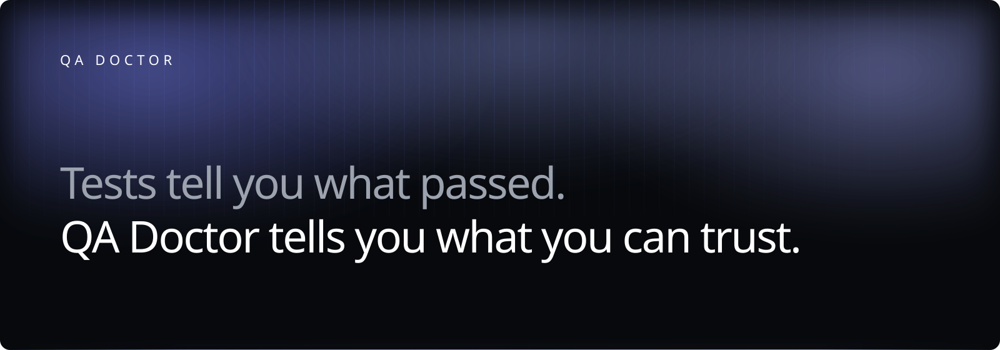
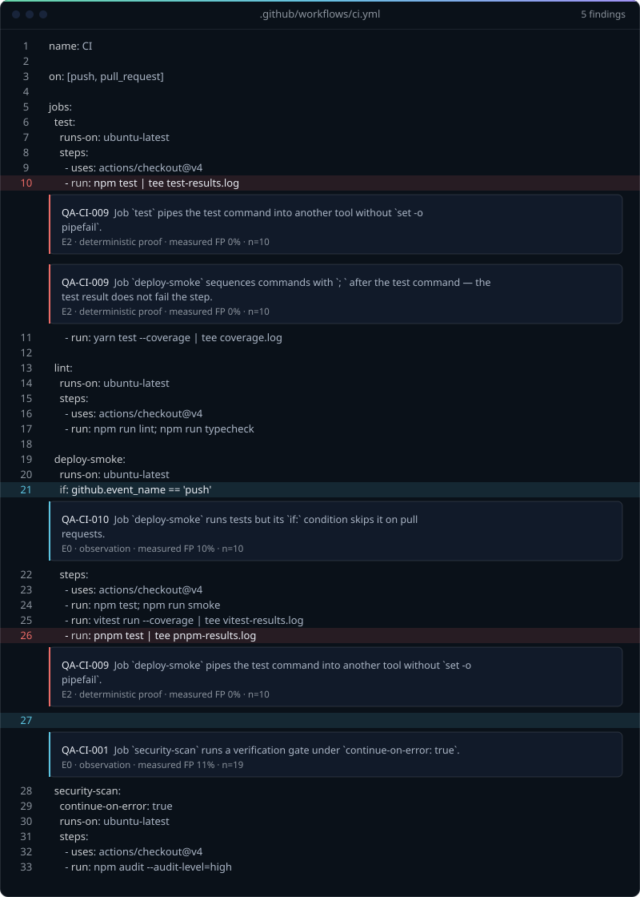
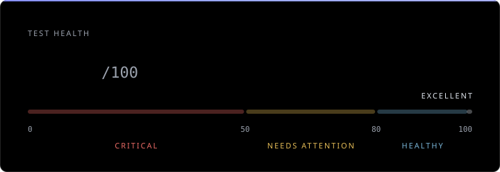

<div align="center">



<br />

**Mjölnir quantifies how much you can trust your CI — and blocks releases when verification isn't earning its keep.**

<br />

[](https://www.npmjs.com/package/mjolnir-qa)
[](https://github.com/Sergey-Bar/Mjolnir/actions/workflows/ci.yml)
[](https://codecov.io/gh/Sergey-Bar/Mjolnir)
[](LICENSE)
[](https://nodejs.org)

```bash
npx mjolnir-qa
```

[**Interactive walkthrough**](https://sergey-bar.github.io/Mjolnir/) · [Docs](https://sergey-bar.github.io/Mjolnir/) · [CHANGELOG](CHANGELOG.md) · [Video](assets/video/mjolnir-demo.mp4)

</div>

---

## The problem: a green check is a claim, not proof

A green check means the pipeline did not fail. It does **not** mean the tests ran, or that they could have failed.

```yaml
# These all ship green. None earned it.
steps:
  - run: npm test || true # exit code swallowed
  - run: pytest tests/ --maxfail=0 # retry wrapper
  - run: playwright test --workers=1 # serial but no --exit-on-failure
  - uses: some/action@main # mutable ref
```

Mjölnir reads your test suite, your CI workflows, and (when available) the report of a real run. It reports every finding with a **trust level** (L0–L5, where L3+ requires a real run) and a **measured false-positive rate** where corpus evidence exists.

<p align="center">
  
</p>

---

## Quickstart

```bash
# 1. Scan — Trust Report, exits 1 on gate findings
npx mjolnir-qa

# 2. Block in CI — scan only what your branch changed
npx mjolnir-qa --scope changed

# 3. Fix and re-verify — safe auto-fixes, each re-scanned to prove it landed
mjolnir fix
```

**Prove the fix with a baseline, then delta:**

```bash
npx mjolnir-qa --save-baseline   # once: writes .mjolnir/baseline.json
# … make the fix …
mjolnir ci verify                 # RESOLVED (gone) / NEW (introduced)
```

---

## What it catches by default (79 rules)

| Family           | Example rules                                                                                                       |
| ---------------- | ------------------------------------------------------------------------------------------------------------------- |
| **CI integrity** | `                                                                                                                   |     | true` swallowing exit codes (`QA-CI-002`), `continue-on-error` on gate jobs (`QA-CI-001`), mutable Action refs (`QA-CI-008`) |
| **Test hygiene** | Committed `.only`/`fit` (`QA-TEST-001`), tests with no assertions (`QA-TEST-003`), hard sleeps (`QA-TEST-004`)      |
| **Test quality** | Unawaited promise assertions (`QA-TQUAL-009`), tautological assertions (`QA-TQUAL-002`)                             |
| **Playwright**   | Unawaited locator assertions (`QA-PW-002`), `page.pause()` committed (`QA-PW-003`), brittle selectors (`QA-PW-004`) |
| **Python**       | Skipped tests (`QA-PY-002`), `time.sleep()` (`QA-PY-005`), tautological assertions (`QA-PY-012`)                    |
| **Java / C#**    | Disabled tests, hard sleeps, no assertions, brittle selectors                                                       |

Full catalog: `mjolnir explain --list --md` or [what-it-checks](https://sergey-bar.github.io/Mjolnir/guide/what-it-checks).

---

## The Worthiness Score

<p align="center">
  
</p>

Severity sets a base deduction (`error −8`, `warning −3`, `info −1`), discounted by evidence level: **E2** (deterministic proof) pays in full, **E1** (pattern) half, **E0** (observation) nothing. Normalized by suite exposure — deductions per test declaration, not per file.

---

## Evidence you can gate on

| Level  | Name                | Means                                              | Deduction |
| ------ | ------------------- | -------------------------------------------------- | --------- |
| **E2** | Deterministic proof | The defect is present in the code as written       | Full      |
| **E1** | Pattern evidence    | A pattern strongly tied to the defect matched      | Half      |
| **E0** | Observation         | Worth knowing. Not a claim that anything is wrong. | Zero      |

Static scans stop at **L2** (proven in code). Give Mjölnir a real run report (Playwright JSON, Jest/Vitest JSON, JUnit XML) and findings lift to **L3–L5** (file ran, test ran, run agrees).

---

## AI agents: SCAN → EVIDENCE → HANDOFF → AGENT → RE-SCAN → PROOF

```bash
# MCP server over stdio (read-only tools: scan, explain, diff, verify, forensics, triage, pw-report)
claude mcp add mjolnir -- npx -y mjolnir-qa mcp

# Deterministic handoff plan for any agent
mjolnir handoff

# Install into your repo's agent surfaces (.claude/, .cursor/, .kilo/, AGENTS.md)
mjolnir install
```

Every finding in a handoff carries its boundary: **E2** = deterministic, apply fix; **E1** = requires confirmation, do not suppress blindly.

---

## Trust and security

- **Local-first, zero telemetry.** No network-capable API exists in `src/`. A contract test (`privacy-network-isolation.spec.ts`) fails the build if one appears. Scanning untrusted code never executes it.
- **Plugins are not sandboxed** — same trust model as ESLint/Vitest plugins. Opt-in per scan with `--enable-plugins`.
- **Self-verifying.** Every CI run scans this repository with the build it produced. The gate fails on any error finding, a partial scan, or a crashed rule. `mjolnir doctor` re-audits the rule base in the same run.

---

## Exit codes (frozen contract)

| Code | Meaning                                                        |
| ---- | -------------------------------------------------------------- |
| `0`  | Clean — no findings at or above the gate                       |
| `1`  | Findings at or above the gate                                  |
| `2`  | Inconclusive — partial scan, unreadable files, or crashed rule |
| `10` | Usage error                                                    |
| `20` | Internal error                                                 |

`2` is distinct from `0`: an incomplete scan has not found nothing — it has not finished looking. No flag turns it into `0`.

---

## What Mjölnir cannot tell you

- It does not run your tests. A clean scan ≠ a passing suite.
- It cannot tell you an assertion is **wrong** — only that it **cannot fail**.
- It does not prove business correctness.
- A score of 100 means: _none of Mjölnir's evaluated rules produced a deduction under this scan and evidence model._
- 6 of 79 rules ship on an author estimate, not a measured FP rate. Each says so on its finding.
- E1 is not E2 — heuristic findings are worth reading, not worth applying blindly.

---

<div align="center">


```bash
npx mjolnir-qa
```

[Read the guide](https://sergey-bar.github.io/Mjolnir/guide/getting-started) · [Docs](https://sergey-bar.github.io/Mjolnir/) · [npm](https://www.npmjs.com/package/mjolnir-qa)

<br />

**Don't ask whether the tests passed.**  
**Ask whether the evidence proves they deserve to be trusted.**

<sub>Built by [Sergey Bar](https://www.linkedin.com/in/sergeybar/) · MIT licensed</sub>

</div>
