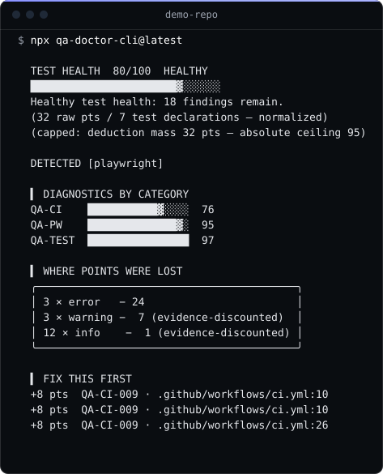

<div align="center">


### Ваші тести вам брешуть. Ми це доводимо.

**Verification Trust Engine для QA.** Mjölnir перевіряє тест-сьюти та
CI-пайплайни, видає показник гідності й показує точно, де ламається
довіра.

[](https://www.npmjs.com/package/mjolnir-qa)
[](https://github.com/Sergey-Bar/Mjolnir/actions/workflows/ci.yml)
[](LICENSE)
[](https://nodejs.org)

[English](README.md) | [简体中文](README.zh.md) | [繁體中文](README.zht.md) | [한국어](README.ko.md) | [Deutsch](README.de.md) | [Español](README.es.md) | [Français](README.fr.md) | [Italiano](README.it.md) | [Dansk](README.da.md) | [日本語](README.ja.md) | [Polski](README.pl.md) | [Русский](README.ru.md) | [Norsk](README.no.md) | [Português (Brasil)](README.br.md) | [ไทย](README.th.md) | [Türkçe](README.tr.md) | Українська | [বাংলা](README.bn.md) | [Ελληνικά](README.gr.md) | [Tiếng Việt](README.vi.md) | [עברית](README.he.md) | [العربية](README.ar.md) | [Bosanski](README.bs.md)

> 🤖 Machine-assisted translation. The [English README](README.md) is canonical. Last synced: 2026-09-04.

```bash
npx mjolnir-qa@latest
```

**Чи заслуговують довіри ваші тести?**

[Подивіться в дії](#-подивіться-в-дії) ·
[Швидкий старт](#-швидкий-старт) ·
[Що він перевіряє](#-що-перевіряє-mjölnir) ·
[Скоринг](#як-працює-скор) ·
[CI](#-інтеграція-ci) · [Конфігурація](#конфігурація) ·
[Документація](#-документація)

</div>

---

## 🎬 Подивіться в дії

<p align="center">
  
</p>

<sub>Повний вивід `npx mjolnir-qa ./examples/demo-repo --verbose`,
відтворений справжнім репортером — нічого не обрізано. Перегенеровується
командою `npm run docs:demo`;
[`tests/demo-asset-reproducibility.spec.ts`](tests/demo-asset-reproducibility.spec.ts)
валить CI, якщо артефакт розійшовся з тим, що друкує інструмент.</sub>

**Що щойно сталося:**

1. Mjölnir знайшов Playwright-спеки, свою конфігурацію, CI-workflow і
   Python-тестовий файл — чотири мови/формати за один прохід.
2. Він знайшов докази, що послаблюють довіру до сьюта —
   `continue-on-error`, що маскує job, `|| true`, що ковтає exit-код,
   жорсткі sleep'и, крихкий селектор, захардкоджені staging-URL,
   очікування `networkidle`.
3. Кожну він перетворив на конкретну знахідку з ID правила, місцем і
   фіксом — і в єдиний скор, за яким можна гейтити PR.

### Одна знахідка зблизька

Запустіть `mjolnir explain QA-CI-001` на першій знахідці вище — і
отримаєте:

```text
▚ QA-CI-001 — continue-on-error masks a failing verification gate

Severity:    error
Confidence:  high
Evidence:    E2
Measured FP: not yet measured — this rule ships on assumption (see docs/FP-AUDIT.md)

WHAT WAS FOUND (real detector output, not a mockup)
  Job `security-scan` runs a verification gate under `continue-on-error: true`.

WHY IT MATTERS
  This job can fail every day and CI will still show green. The checkmark
  on this workflow cannot be trusted.

HOW TO FIX
  Remove continue-on-error, or scope it to individual non-blocking steps only.
```

Ось одиниця цінності: не дрібниця стилю, а місце, де ваш CI каже, що
щось пройшло, хоча воно не пройшло.

---

## ⚡ Швидкий старт

Запустіть на репозиторії — отримаєте повний звіт і показник гідності:

```bash
npx mjolnir-qa@latest
```

**У CI продукт — одна команда.** Вона сканує лише зачеплене гілкою та
завершується з ненульовим кодом за нових проблем:

```bash
npx mjolnir-qa@latest --scope changed
```

Вбудуйте це у PR-check — `mjolnir ci install` пише workflow — і готово.
Все інше опціональне.

| Команда                             | Що робить                                                 |
| ----------------------------------- | --------------------------------------------------------- |
| `mjolnir`                           | Скан усього репо + показник гідності                      |
| `mjolnir --scope changed`           | Лише те, що принесла ваша гілка — CI-режим                |
| `mjolnir ci install`                | Генерує рекомендаційний PR-workflow                       |
| `mjolnir explain QA-CI-001`         | Що / чому / фікс + виміряний FP-рейт для правила          |
| `mjolnir rules --unmeasured`        | Правила, що працюють за припущенням, а не за вимірюванням |
| `mjolnir --json` / `--format sarif` | Машинночитабельно / GitHub Code Scanning                  |
| `mjolnir --strict`                  | Також правила tier-у quarantine (вищий ризик FP)          |

<details>
<summary><strong>Коли щось флає</strong></summary>

| Команда                             | Що робить                                                     |
| ----------------------------------- | ------------------------------------------------------------- |
| `mjolnir forensics ./test-results/` | Реальні дані прогонів → вердикти `TRUE-FLAKE`, `FLAKY.md`     |
| `mjolnir triage ./test-results/`    | Пропозиція карантину з історії виконання                      |
| `mjolnir pw-report ./test-results/` | Зведення прогону Playwright — ретраї / флейки / найповільніші |
| `mjolnir doctor:playwright`         | Глибокий скан лише Playwright + Selector Health Score         |

</details>

<details>
<summary><strong>Зрідка / звіти</strong></summary>

| Команда                         | Що робить                                         |
| ------------------------------- | ------------------------------------------------- |
| `mjolnir fix --dry-run` / `fix` | Безпечні автофікси з доказом                      |
| `mjolnir baseline` / `diff`     | Знімок знахідок, далі звіт лише нових/погіршених  |
| `mjolnir impact --since <ref>`  | Що змінилося з моменту ранішого коміту            |
| `mjolnir debt`                  | Реєстр тестового боргу з моделлю вартості         |
| `mjolnir handover`              | Карта онбордингу сьюта для нового QA              |
| `mjolnir stats`                 | Локальні накопичені лічильники побачених фіксів   |
| `mjolnir badge`                 | JSON shields.io-ендпоінту + сніпет                |
| `mjolnir rules --md`            | Повний каталог правил (JSON або Markdown)         |
| `mjolnir doctor`                | Самоаудит власної бази правил Mjölnir             |
| `mjolnir create-rule <ID>`      | Скаффолд нового правила + фікстур                 |
| `mjolnir --format mermaid`      | Діаграма тестової архітектури для коментаря до PR |

</details>

Установіть глобально замість `npx`, якщо так зручніше:
`npm i -g mjolnir-qa`. Потребує Node.js ≥ 22.18. Працює на Windows,
macOS і Linux.

---

## 👥 Для кого це?

- **QA / SDET**, які володіють e2e- чи інтеграційним с'ютом і яким
  потрібні докази, що с'ют справді заслуговує зелену галочку, яку він
  видає.
- **Платформові / DevEx-команди**, відповідальні за цілісність CI та
  release-gates — ті, для кого `continue-on-error` ніколи не повинен
  мовчки перефарбовувати червоний пайплайн у зелений.
- **OSS-мейнтейнери**, яким потрібен дешевий, завжди увімкнений
  верифікаційний гейт, що працює локально й у CI без мережевих
  викликів.

---

## 🔨 Що перевіряє Mjölnir

|     |                                                                                                                              |
| --- | ---------------------------------------------------------------------------------------------------------------------------- |
| ⚖️  | **Показник гідності** — одне число, прозора таблиця відрахувань, жодного чорного ящика                                       |
| 🎭  | **Selector Health Score** — оцінює ваші Playwright-локатори, а не лише pass-rate                                             |
| 🔬  | **Runtime-криміналістика** — читає реальні дані прогонів Playwright/JUnit і ловить `TRUE-FLAKE`, а не лише статичні здогадки |
| 🚨  | **Правила цілісності CI** — ловить `continue-on-error`, `\|\| true` та інші трюки з хибним зеленим                           |
| 🐍  | **Усі чотири Playwright-бінінги** — TypeScript, Python, Java, C#/.NET — плюс pytest, JUnit/TestNG і CI-workflows             |
| 🔒  | **Local-first** — нуль мережевих викликів під час сканування, нуль телеметрії, робота за секунди                             |

### Правила

Кожне правило постачається з must-fire- **та** must-not-fire-фікстурами.
Правило, що спрацьовує на власній негативній фікстурі, не може вийти —
це фаєрвол хибних спрацювань.

<details>
<summary><strong>Тест-гігієна</strong></summary>

| ID          | Правило                                                 | Severity |
| ----------- | ------------------------------------------------------- | -------- |
| QA-TEST-001 | Закомічено сфокусований тест (`.only`, `fit`)           | error    |
| QA-TEST-002 | Пропущено тест без обґрунтування                        | error    |
| QA-TEST-002 | Пропущено тест з облікованим обґрунтуванням             | warning  |
| QA-TEST-003 | Тест без ассертів                                       | error    |
| QA-TEST-004 | Жорсткий sleep (`waitForTimeout`, `sleep()`, `delay()`) | warning  |
| QA-TEST-006 | Зловживання ретраями, що приховує флейкість             | warning  |
| QA-TEST-010 | Порожнє тіло тесту                                      | error    |

</details>

<details>
<summary><strong>Якість тестів</strong></summary>

| ID           | Правило                       | Severity |
| ------------ | ----------------------------- | -------- |
| QA-TQUAL-001 | Верифікація лише моками       | info     |
| QA-TQUAL-002 | Тавтологічний ассерт          | error    |
| QA-TQUAL-009 | Ассерт не-awaitнутого promise | error    |
| QA-TQUAL-011 | Закоментовані тести           | warning  |

</details>

<details>
<summary><strong>Playwright 🎭</strong></summary>

| ID        | Правило                                       | Severity |
| --------- | --------------------------------------------- | -------- |
| QA-PW-002 | Ассерт локатора без await                     | error    |
| QA-PW-003 | `page.pause()` / `test.only()` у коміті       | error    |
| QA-PW-004 | Крихкі CSS/XPath-селектори                    | warning  |
| QA-PW-005 | Бізнес-логіка всередині `page.evaluate()`     | info     |
| QA-PW-114 | Легасі element handles (`page.$`)             | info     |
| QA-PW-118 | Очікування `networkidle` (флейкові by design) | info     |
| QA-PW-123 | Захардкоджені URL середовищ                   | warning  |

</details>

<details>
<summary><strong>Цілісність CI</strong></summary>

| ID        | Правило                                                          | Severity |
| --------- | ---------------------------------------------------------------- | -------- |
| QA-CI-001 | `continue-on-error` маскує падіння                               | error    |
| QA-CI-002 | `\|\| true` ковтає exit-коди                                     | error    |
| QA-CI-005 | Звіт споживається, але ніколи не генерується                     | error    |
| QA-CI-007 | Retry-обгортки навколо тестів                                    | warning  |
| QA-CI-008 | Завжди успішний крок маскує падіння                              | error    |
| QA-CI-009 | Exit-код тесту не прокидається (`\|` без pipefail, ланцюжки `;`) | error    |
| QA-CI-010 | Тести пропускаються там, де мають блокувати (skip-on-PR-гарди)   | error    |

</details>

<details>
<summary><strong>Python / pytest 🐍</strong></summary>

| ID        | Правило                                     | Severity |
| --------- | ------------------------------------------- | -------- |
| QA-PY-002 | Пропущений тест (`skip`, нестрогий `xfail`) | warning  |
| QA-PY-003 | Тестова функція без ассертів                | error    |
| QA-PY-005 | `time.sleep()` у тестах                     | warning  |
| QA-PY-006 | Порожнє тіло тесту (`pass`)                 | info     |
| QA-PY-010 | Залежність від випадковості/часу без freeze | info     |
| QA-PY-012 | Тавтологічний ассерт                        | error    |

Усього 20 Python-правил (QA-PY-001…012 гігієна pytest + QA-PY-101…108 Playwright-Python).

</details>

<details>
<summary><strong>Java / JUnit · TestNG ☕</strong></summary>

| ID        | Правило                                      | Severity |
| --------- | -------------------------------------------- | -------- |
| QA-JV-101 | Вимкнений тест (`@Disabled`)                 | warning  |
| QA-JV-102 | Жорсткий sleep (`Thread.sleep()`)            | warning  |
| QA-JV-103 | Тестовий метод без ассертів                  | error    |
| QA-JV-105 | Жорсткий sleep Playwright `waitForTimeout()` | warning  |
| QA-JV-106 | Крихкий селектор замість role-локатора       | warning  |
| QA-JV-108 | Захардкоджений URL середовища у тесті        | info     |
| QA-JV-111 | Бланкетний мок `page.route("**")`            | info     |

</details>

<details>
<summary><strong>C# / .NET — NUnit · xUnit · MSTest 🟣</strong></summary>

| ID        | Правило                                        | Severity |
| --------- | ---------------------------------------------- | -------- |
| QA-CS-101 | Пропущений тест (`[Ignore]`, `[Fact(Skip=)]`)  | warning  |
| QA-CS-102 | Жорсткий sleep (`Thread.Sleep` / `Task.Delay`) | warning  |
| QA-CS-103 | Тестовий метод без ассертів                    | error    |
| QA-CS-105 | Жорсткий sleep `WaitForTimeoutAsync()`         | warning  |
| QA-CS-106 | Крихкий селектор замість role-локатора         | warning  |
| QA-CS-108 | Захардкоджений URL середовища у тесті          | info     |
| QA-CS-111 | Бланкетний мок `page.RouteAsync("**")`         | info     |

</details>

> Повний живий каталог — кожне правило з tier, confidence, ризиком
> хибних спрацювань і доступністю автофікса — генерується з реєстру:
>
> ```bash
> mjolnir rules --md
> ```
>
> Сторінки за правилами лежать у [`docs/rules/`](docs/rules/).

### Скільки з цього виміряно

**74 з 99 правил несуть хибнопозитивну частоту, виміряну на реальному
OSS-коді** (по ≥ 10 вручну класифікованих знахідок на правило; див.
[docs/FP-AUDIT.md](docs/FP-AUDIT.md)). Інші 19 виходять на оцінці
автора. Футер кожного скана каже, скільки із _спрацьованих_ правил
виміряно; `mjolnir rules --unmeasured` перелічує невиміряні; сторінка
`mjolnir explain` кожного правила вказує її статус. Ми публікуємо
частоту, навіть коли вона негарна — QA-CS-103 аудитується на 95 % і за
це відправлено в карантин. Збільшувати ці 78 — постійна робота проєкту.

### Тіри правил і зрілість мов

Кожне правило — `core`, `extended` чи `quarantine`, призначене за його
**виміряною** частотою хибних спрацювань:

| Tier         | Значення                               | Скан за замовчуванням | `--strict` |
| ------------ | -------------------------------------- | :-------------------: | :--------: |
| `core`       | ≤ 10 % виміряних FP                    |          ✅           |     ✅     |
| `extended`   | ≤ 30 % виміряних FP                    |          ✅           |     ✅     |
| `quarantine` | понад 30 % або ще не виміряно (n < 10) |          ❌           |     ✅     |

| Мова            | Адаптер         | Охват сьогодні                                              |
| --------------- | --------------- | ----------------------------------------------------------- |
| TypeScript / JS | AST компілятора | найширший, найбільш виміряний — переважно `core`/`extended` |
| Python / pytest | Regex-шар       | широкий, перевірений корпусом — переважно `core`/`extended` |
| Java            | Regex-шар       | новіший — переважно `extended`/`quarantine`                 |
| C# / .NET       | Regex-шар       | новіший — переважно `extended`/`quarantine`                 |

У TypeScript і Python найширший виміряний охват. Java і C# вийшли,
задокументовані й залишаються за межами головного числа, доки реальний
с'ют-споживач (не власні тести біндинг-бібліотеки) не буде проаудовано.

---

## Як працює скор

<p align="center">
  
</p>

<sub>Перегенеровується командою `npm run docs:hero`;
[`tests/hero-asset-reproducibility.spec.ts`](tests/hero-asset-reproducibility.spec.ts)
валить CI, якщо артефакт розійшовся з тим, що друкує репортер.</sub>

Скор прозорий: **error −8, warning −3, info −1**, далі нормування на
експозицію с'юта (відрахування на оголошення тесту). Відрахування,
зважені за доказами, означають, що слабкі сигнали коштують дешевше.
Термінал показує ті самі зі скидкою числа, що використовує скор —
жодного чорного ящика. Повна методика: [docs/SCORING.md](docs/SCORING.md).

**Вердикти**

| Score   | Вердикт          |
| ------- | ---------------- |
| ≥ 80    | ✓ **WORTHY**     |
| 50 – 79 | ⚠ **NEEDS WORK** |
| < 50    | ✖ **UNWORTHY**   |

**Рівні доказів** — кожна знахідка несе один; він задає вагу знахідки в
скорі:

| Рівень | Значення              | Вплив на скор          | Приклад                                                 |
| ------ | --------------------- | ---------------------- | ------------------------------------------------------- |
| E2     | Детермінований дефект | Повне відрахування     | `.only` у коміті — структурно доказово                  |
| E1     | Евристичний патерн    | Половинне відрахування | Знайдений regex'ом `sleep()` — сильний сигнал, не доказ |
| E0     | Спостереження         | Нуль (тільки info)     | Репортиться, але ніколи не гейтить CI і не віднімає     |

Більшість правил — **E1**. Слоган «we prove it» відсилає до цієї
системи: знахідки E2 — структурне доказ; знахідки E1 — коректно
позиційовані попередження, не формальні докази.

Порожній репозиторій отримує `null`, ніколи фейкову сотню — див.
[Модель довіри](#модель-довіри).

---

## 🎭 Selector Health Score

Головна метрика для Playwright-с'ютів — наскільки стійкі ваші локатори:

```text
▚ SELECTOR HEALTH — e2e/checkout.spec.ts

  [█████████████████░░░]  83 / 100
  role/text: 2 · testid: 1 · css-chains: 1 ⚠ · xpath: 0
```

Локатори на основі ролей отримують повний бал. Ланцюжки CSS-класів і
XPath топлять скор — вони ламаються на будь-якому DOM-рефакторі, не
повідомляючи, яку поведінку регресовано.

---

## 🔬 Runtime-докази

Статичне виявлення флейкості — гадання. Mjölnir читає **реальні дані
виконання** — JSON-звіти Playwright та XML JUnit від будь-якого
раннера:

```bash
mjolnir forensics ./test-results/
```

```text
▚ FLAKINESS LEADERBOARD

3 tests · 1 failed · 1 flaky · 1 retried

TRUE-FLAKE completes checkout with saved card (e2e/checkout.spec.ts)
           ████████████████████ 6.0s · 2 attempts
FAILING    declines an expired card (e2e/checkout.spec.ts)
           ████░░░░░░░░░░░░░░░░ 1.1s · 1 attempt
```

Тест, що проходить лише з спроби ≥ 2, — не прохідний тест; це везучий
тест. Він позначається `TRUE-FLAKE` незалежно від фінальної зеленої
галочки.

---

## ⚡ Mjölnir — не ще один лінтер

Лінтери кажуть, чи відповідає код правилам. Mjölnir каже, чи можна
довіряти вашій верифікації.

|                                                           | ESLint / SonarQube | Coverage-інструменти | Ручне рев'ю | **Mjölnir** |
| --------------------------------------------------------- | :----------------: | :------------------: | :---------: | :---------: |
| Цілісність CI-workflow (`continue-on-error`, `\|\| true`) |         ❌         |          ❌          |    рідко    |     ✅      |
| Крос-мова (TS, Python, Java, C#) з одного інструменту     |         ❌         |          ❌          |     ❌      |     ✅      |
| Оцінює стійкість Playwright-локаторів (Selector Health)   |         ❌         |          ❌          |    рідко    |     ✅      |
| Позначає тести без справжніх ассертів                     |   ✅ (плагін)\*    |          ❌          |    іноді    |     ✅      |
| Ловить жорсткі sleep'и (`waitForTimeout`, `time.sleep`)   |   ✅ (плагін)\*    |          ❌          |    іноді    |     ✅      |
| Працює за секунди, нуль мережевих викликів під час скана  |         ✅         |          ✅          |      —      |     ✅      |

\*`eslint-plugin-jest` (`expect-expect`) і `eslint-plugin-playwright`
(`expect-expect`, `no-wait-for-timeout`) покривають це для своїх
фреймворків.

**Runtime-аналіз** — окрема категорія поруч зі статичним лінтингом:

|                                                        | Playwright retry reporter | Allure / ReportPortal | **Mjölnir forensics** |
| ------------------------------------------------------ | :-----------------------: | :-------------------: | :-------------------: |
| Читає реальні дані прогонів для вердиктів `TRUE-FLAKE` |        частково\*         |    частково (тег)     |          ✅           |
| Звіт флейк-тріажу з історії виконання                  |            ❌             |          ✅           |          ✅           |
| Інтегрується зі статичним скором гідності              |            ❌             |          ❌           |          ✅           |

\*Playwright відстежує ретраї всередині, але не видає самостійного
звіту про флейкість з вердиктними мітками.

---

## 🤖 Чому б не використати просто AI-код-рев'ю?

Інша проблема, інший шар. AI-рев'ю може помітити підозрілу зміну тесту
в дифі; воно не доводить, що система верифікації в цілому заслуговує
довіри — і бачить лише показаний йому диф.

|                                                   |   AI-код-рев'ю (Copilot тощо)    |            **Mjölnir**            |
| ------------------------------------------------- | :------------------------------: | :-------------------------------: |
| Ціна за скан                                      | Токени (ростуть з розміром дифа) | **Нуль** (локально, встановлений) |
| Бачить увесь с'ют + усі CI-конфіги                |   Лише PR-диф, показаний йому    |          **Все, щоразу**          |
| Детермінований (той самий вхід → той самий вихід) |      ❌ (недетермінований)       |              **✅**               |
| Ловить патерни, що дрімають місяцями              |      Лише якщо в контексті       |     **✅** (сканує всі файли)     |
| Пам'ятає знахідки між запусками                   |  ❌ (немає пам'яті між сесіями)  |     **✅** (baseline + diff)      |
| Запускається без людини                           |      Потрібен PR чи промпт       |    **✅** (CI-хук, 3 секунди)     |

**Використовуйте обидва.** AI ловить нюанс, задум і дизайнерські вади,
яких не знайде жоден regex. Mjölnir ловить структурні патерни, які AI
упускає, бо ті виглядають «наміреними» — закомічений `.only`,
проковтнутий exit-код, `continue-on-error` на тестовому job. Це не
баги, що потребують міркувань; це факти, що потребують сканування.

---

## 🤖 Інтеграція CI

Одна команда генерує PR-workflow — за замовчуванням рекомендаційний,
ніколи блокувальний:

```bash
mjolnir ci install
```

Або підключіть нативно до GitHub Code Scanning через SARIF:

```yaml
- run: npx mjolnir-qa@latest --format sarif > mjolnir.sarif
- uses: github/codeql-action/upload-sarif@v3
  with:
    sarif_file: mjolnir.sarif
```

Налаштування редактора і пайплайну для SARIF:
[docs/SARIF-INTEGRATION.md](docs/SARIF-INTEGRATION.md).

### Охват за зміненим scope

`--scope changed` атрибуцію знахідок рядкам, доданим у вашій гілці
відносно merge-base з `main`. Він покриває тестові файли
(`*.spec.*`, `*.test.*`), плюс workflow-файли GitHub і конфігурації
Playwright у дифі. Коли merge-base не розв'язується — shallow clone,
detached HEAD, не-git-ціль, інша дефолтна гілка — він чесно деградує:
знахідки повертаються до атрибуції на весь файл, і звіт про це каже.
Перевизначте базову ref через `--base <ref>`.

---

## Конфігурація

Mjölnir — zero-config. Опціональний `mjolnir.config.json` (або
`.mjolnir.json`) у корені репо підлаштовує severity, гейтинг і scope —
він ніколи не змінює семантику детекції.

| Key                 | Тип                                  | Дія                                                                                                                                                             |
| ------------------- | ------------------------------------ | --------------------------------------------------------------------------------------------------------------------------------------------------------------- |
| `exclude`           | `string[]`                           | Додаткові ignore-глоби (підмножина gitignore), поверх вбудованих дефолтів                                                                                       |
| `gate`              | `"advisory" \| "error" \| "warning"` | Які severity завершують процес ненульовим кодом (за замовчуванням `error`; `advisory` ніколи не блокує)                                                         |
| `severityOverrides` | `{ "<RULE-ID>": severity }`          | Переранговує знахідки правила для вашого репо                                                                                                                   |
| `ignore`            | `IgnoreEntry[]`                      | Пригнічує знахідки — **`reason` обов'язковий**; записи спливають через 90 днів (явна дата `expires`, або час останньої зміни файлу конфіга для записів без неї) |
| `plugins`           | `string[]`                           | Сторонні пакети правил (див. [Модель довіри](#модель-довіри))                                                                                                   |

```json
{
  "gate": "error",
  "exclude": ["legacy/**"],
  "severityOverrides": { "QA-PW-118": "warning" },
  "ignore": [
    {
      "ruleId": "QA-TEST-004",
      "files": ["e2e/legacy-login.spec.ts"],
      "reason": "Third-party widget needs a settle delay; tracked in JIRA-4821",
      "expires": "2026-12-31"
    }
  ]
}
```

- **`.mjolnirignore`** — простий файл у стилі gitignore для винятків
  шляхів, той самий діалект, що `exclude`. Використовуйте його для
  машинного шуму; використовуйте `exclude`, коли список має жити у
  версійному контролі разом з іншою конфігурацією.
- **CLI-перевизначення** — `--strict` (увімкнути правила карантину),
  `--width <cols>` і `--ascii` / `--no-ascii` (термінальний рендер),
  `--tone blunt` (різкіші повідомлення), `--max-duration <sec>`
  (обмежений частковий скан).
- Пригнічення правил і життєвий цикл депрекації:
  [docs/RULE-LIFECYCLE.md](docs/RULE-LIFECYCLE.md).

Записи `ignore` також живлять окрему команду `mjolnir suppressions`,
яка перелічує поточні пригнічення та час спливання кожного запису.

---

## 📐 Коди виходу та контракти

Заморожені — безпечно будувати на них CI-логіку:

| Код виходу | Значення                                                                      |
| ---------- | ----------------------------------------------------------------------------- |
| `0`        | Чисто — немає знахідок на рівні гейта або вище                                |
| `1`        | Знахідки на рівні гейта або вище                                              |
| `2`        | Частковий скан (вичерпано бюджет часу, нечитабельні файли) — ніколи не блокує |
| `10`       | Помилка використання (поганий прапор, відсутня ціль)                          |
| `20`       | Внутрішня помилка                                                             |

JSON/SARIF-звіт — `schemaVersion: 1`. ID правил (`QA-<FAMILY>-NNN`)
незмінні після виходу і ніколи не використовуються повторно.

---

## Модель довіри

- **Local-first** — нуль мережевих викликів під час сканування. Ніколи.
  Нуль телеметрії.
- **Жодних хибних доказів** — ми радше скажемо «невідомо», ніж
  «перевірено». Порожнє репо отримує `score: null`, ніколи фейкову
  сотню.
- **Часткова чесність** — якщо аналіз обірвано, вивід про це каже.
  Ніколи «complete», коли це не так.
- **FP-фаєрвол** — детекція працює на очищеному від коментарів і рядків
  поданні коду (правила TypeScript використовують AST компілятора):
  патерн усередині прозаїчного коментаря чи док-прикладу-рядка — це
  документація, а не знахідка.
- **Виміряно, а не заявлено** — у головні тіри виходять лише правила з
  частотою хибних спрацювань з реального OSS-коду (див.
  [Скільки з цього виміряно](#скільки-з-цього-виміряно)); футер скана і
  `mjolnir rules --unmeasured` скажуть, які які.
- **Довіра до плагінів** — плагіни — це npm-пакети, оголошені у
  `"plugins"`. **Пісочниці немає**: код плагіна працює з повними
  привілеями Node, та сама модель довіри, що в плагінів ESLint чи
  Vitest. Префікси ID основних правил зарезервовані й відкидаються від
  плагінів проти підміни.
- **Workspace-локальні зовнішні правила** (фолдерні, нуль мережі) —
  каталог `mjolnir-rules/` поруч із ціллю скана завантажує власні
  правила: JSON-файли декларують regex-патерни (код не виконується),
  модулі `.mjs`/`.js` експортують `rules` (повна довіра Node, як у
  плагінів). Зовнішні правила несуть ті самі trust-метадані, що й
  core; вони ніколи не можуть вийти в core-тирі (core вимагає
  виміряної FP-частоти з corpus-сайдкара — заявлений `tier: "core"`
  затискається до `extended`), дотримуються тирових лімітів і
  перевіряються на дрейф: `mjolnir rules --md --external` рендерить
  каталог із завантажених файлів (походження `external`), а генератор
  матриці приймає `--external <root>`.

---

## 🏗️ Архітектура

<details>
<summary>Розгорнути дерево</summary>

```
mjolnir/
├── src/
│   ├── engine/          # LanguageAdapter interface + rule runner
│   ├── adapters/        # typescript · python · java · csharp · github-actions
│   ├── rules/           # rules across 8 families + the measured-FP table
│   ├── playwright/      # Selector Health Score engine
│   ├── discovery/       # workspace, frameworks, ignore resolution
│   ├── scope/           # git merge-base changed-scope engine
│   ├── scorer/          # transparent deduction table + prioritization
│   ├── reporter/        # terminal · JSON · SARIF 2.1 · Mermaid
│   ├── forensics/       # run-data ingestion · flake verdicts · triage
│   ├── config/          # mjolnir.config.json + suppressions
│   ├── plugins/         # third-party rule loading (no sandbox)
│   └── commands/        # every subcommand
└── tests/
    ├── fixtures/        # must-fire / must-not-fire per rule
    └── golden/          # frozen score regression locks
```

</details>

- **Правила — чисті функції** — `(SourceFileContext) → Finding[]`, без
  I/O, без глобалів. Новий екосистем = один адаптер + його правила.
- **TypeScript/Playwright використовує AST компілятора** (ts-morph).
  Python, Java і C# працюють на спільному regex-шарі з маскуванням
  коментарів і рядків.
- Шар tree-sitter WASM AST для Java і C# існує і є наступним кроком
  точності — він ще не підключений до синхронного скан-пайплайну.

---

## 📚 Документація

| Документ                                               | Що всередині                                  |
| ------------------------------------------------------ | --------------------------------------------- |
| [docs/SCORING.md](docs/SCORING.md)                     | Нормування скора + зважування за доказами     |
| [docs/FP-AUDIT.md](docs/FP-AUDIT.md)                   | Виміряні частоти хибних спрацювань + методика |
| [docs/RULE-LIFECYCLE.md](docs/RULE-LIFECYCLE.md)       | Стани правил, пригнічення, депрекація         |
| [docs/SARIF-INTEGRATION.md](docs/SARIF-INTEGRATION.md) | SARIF-вивід + налаштування редактора/CI       |
| [docs/rules/](docs/rules/)                             | Згенерований каталог за правилами             |
| [CONTRIBUTING.md](CONTRIBUTING.md)                     | Dev-сетап + процес контрибуції                |
| [CHANGELOG.md](CHANGELOG.md)                           | Історія релізів                               |
| [SECURITY.md](SECURITY.md)                             | Повідомлення про вразливості                  |

---

## 📈 Статус

**v0.5.x · відкрита бета.** JSON-схема і коди виходу — заморожені
контракти. TypeScript і Python мають найширший виміряний охват; Java і
C# новіші — читайте про них у
[таблиці тирів](#тіри-правил-і-зрілість-мов).

---

## 🤝 Участь у проєкті

Нові правила — найпростіший перший внесок: одна команда скаффолдить
правило і його must-fire- **та** must-not-fire-фікстури (згенероване
правило намірово падає на фікстурах, поки ви не реалізуєте реальну
детекцію — стаб не може вийти):

```bash
mjolnir create-rule QA-PW-140 --title "Screenshot without diff bound"
```

Повний dev-сетап, команди постійного гейта і закони anti-creep /
фікстурного фаєрвола — у [CONTRIBUTING.md](CONTRIBUTING.md).

---

<div align="center">

**Перестаньте випускати тести, яким не можна довіряти.**

```bash
npx mjolnir-qa@latest
```

**Star ⭐ · Watch 👀 · Contribute 🤝**

Створено [Сергієм Баром](https://www.linkedin.com/in/sergeybar/)

</div>
